# Awesome-CLIP

- [Awesome-CLIP](#awesome-clip)
  - [Train](#train)
  - [Improvement \& Innovation](#improvement--innovation)
  - [Data](#data)
  - [Distillation](#distillation)
  - [Loss](#loss)
  - [Zero-Shot \& Few-Shot \& Classification](#zero-shot--few-shot--classification)
  - [Retrieval](#retrieval)
  - [Segmentation](#segmentation)
  - [Captioning](#captioning)
  - [Other](#other)

## Train

| Title | Abstract | Intro | Useful Links |
|:----| :---:| :----: | :---:|
|2022|
|    **SUPERVISION EXISTS EVERYWHERE: A DATA EFFICIENT CONTRASTIVE LANGUAGE-IMAGE PRE-TRAINING PARADIGM**  | 本文提出一种创新的CLIP训练方式--Data efficient CLIP (DeCLIP)，来解决CLIP训练对文本-图像pair数据量的需求.  核心思想就是增加对图像-文本对的supervision(增加更多约束)，更有效地学习通用的视觉特征. 作者增加了以下监督：1.每个模态内的self-supervision;2.跨模态的多视图supervision(数据增强后的view);3.来自其他相似对的最近邻supervision.  实验证明，与base CLIP相比，更少的训练数据取得了更高的表现.   🧟‍♂️:Nearest-Neighbor Supervision处设计了一个FIFO的队列，个人觉得借鉴了MoCo的思想，很有意思👍 |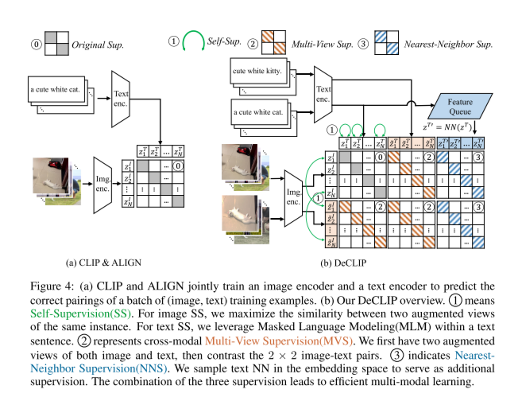| [[Github](https://github.com/Sense-GVT/DeCLIP)]   [[Paper](https://arxiv.org/pdf/2110.05208)] |
|    **RegionCLIP: Region-based Language-Image Pretraining**  |虽然CLIP在zero-shot和transfer learning settings这样的图片分类任务上表现不俗，但如果直接将CLIP应用到目标检测这种识别图像区域的任务上，表现很差. 原因是存在domain shift，CLIP基于image-text pair的数据集训练，建立的是图片整体和文本描述的联系，与文本没有做局部、细粒度的对齐 . 为了解决这个问题，本文提出regionCLIP ，将图片局部与对应描述对齐，在特征空间实现region-text 对齐. 实验证明，在下游检测任务上，与CLIP相比性能明显提升.   🧟‍♂️: pretrain期间显式对齐图像区域和文本标记，有个点，无需人工标注region区域caption，使用的是伪标签，具体做法，建立一个object类别候选池，通过预训练的CLIP，可以将region（RPN提取）与object match起来，然后利用固定的prompt模版生成caption，比如region是一只狗，描述就是 a photo of dog.  这里如果借助LLaVa等模型生成caption，效果会不会更好？当然pretrain成本也会更高，需要balance. | 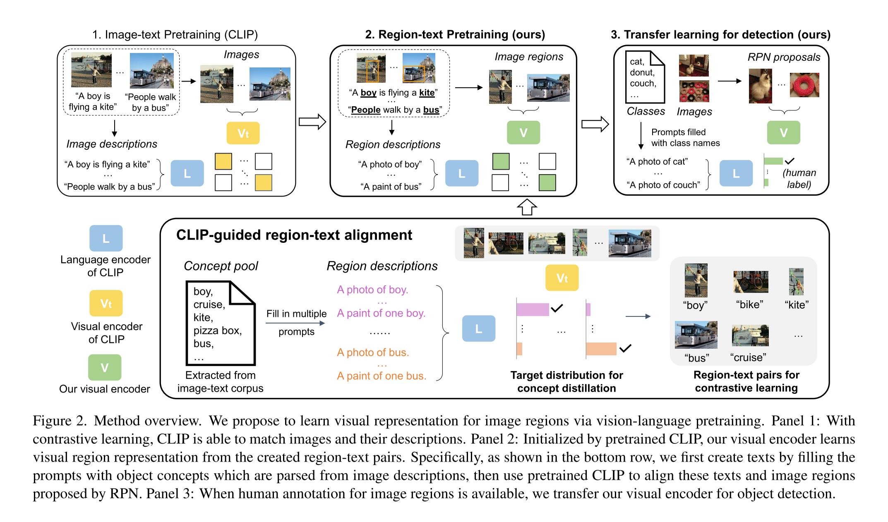 | [[Github](https://github.com/microsoft/RegionCLIP)]   [[Paper](https://arxiv.org/pdf/2112.09106)] |
|2023|
| **Less is More: Removing Text-regions Improves CLIP Training Efficiency and Robustness**  | CLIP没有区分嵌入在图像中的文本区域的视觉语义和意义. 当嵌入区域中的文本与图像的视觉外观不匹配时，这可能导致不鲁棒性. 文章提出两种有效的方法来提高CLIP训练的效率和鲁棒性：1. 在保持相同数量的优化步骤的同时增强训练数据集；2.过滤掉图像中包含文本区域的样本.  在ImageNet和CoCo等数据集上测试，文章方法提高了Clip在下游任务的分类和检索准确率.  |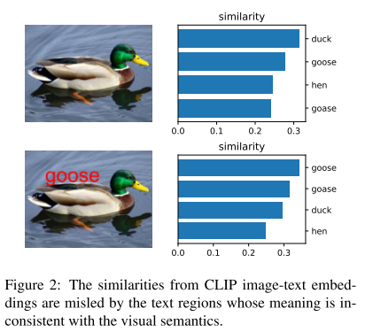| [[Paper](https://arxiv.org/pdf/2305.05095)] |
|    **CLIPA: An Inverse Scaling Law for CLIP Training**  | 文章提出了一个令人惊讶的发现，即CLIP训练存在inverse scaling law，即使用的图像/文本编码器越大，可以用于训练的图像/文本tokens的序列长度越短. 此外，减少图像/文本tokens长度的策略，在确定这种缩放定律的质量方面起着至关重要的作用. 文章在有限的资源下成功训练了Clip. |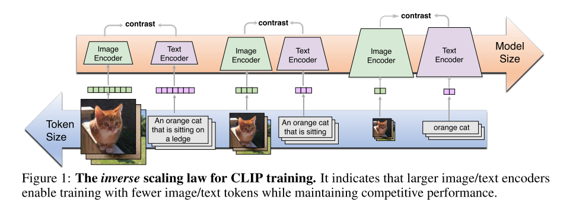| [[Github](https://github.com/UCSC-VLAA/CLIPA)]   [[Paper](https://arxiv.org/pdf/2305.07017)] |
|    **CLIPA-v2: Scaling CLIP Training with 81.1% Zero-shot ImageNet Accuracy within a $10,000 Budget; An Extra $4,000 Unlocks 81.8% Accuracy**  | 在CLIPA基础上，验证了full resolution 的token微调模型时，inverse scaling law也适用;同时验证各种不同训练参数下模型的能力，包括模型大小、数据和training schedule. |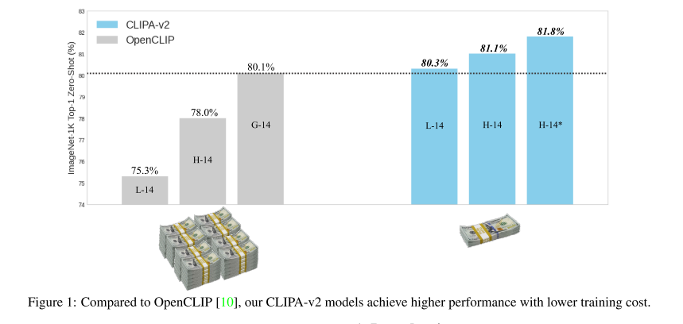| [[Github](https://github.com/UCSC-VLAA/CLIPA)]   [[Paper](https://arxiv.org/pdf/2306.15658)] |
|    **Scaling Language-Image Pre-training via Masking**  | 文章提出了一种简单而有效的CLIP训练方法---FLIP（Fast Language-Image Pre-training）.该方法只需要在训练时随机Mask掉一部分图像. 实验证明，与标准CLIP详细，该方法在训练速度和模型精度方面都有提升. 文章受到MAE的启发. 引入masking，使模型在“how carefully we look at a sample pair” 和 “how many sample pairs we can process”之间做trade-off. 因为Vit encoder只用于visible patches，当mask掉一部分图像时，可以节约相应的显存，这样降低了计算量，可以使用更大的batchsize，对contrastive loss更加友好.  同时，masking作为一种形式的噪声和正则化可以提高鲁棒性.  |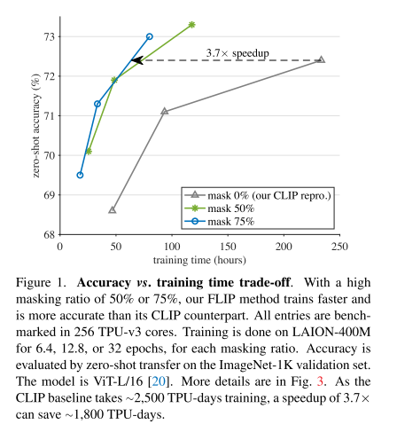| [[Github](https://github.com/facebookresearch/flip)]   [[Paper](https://arxiv.org/pdf/2212.00794)] |
|    **Improving CLIP Training with Language Rewrites**  | 在CLIP训练过程中，只对图像数据做了数据增强，而文本数据保持不变. 针对此问题，作者提出了Language augmented CLIP (LaCLIP), 利用LLM的上下文学习能力，重新描述训练集的captions，增加文本的多样性. 实验表明，在下游zero-shot任务上，性能有明显提升.|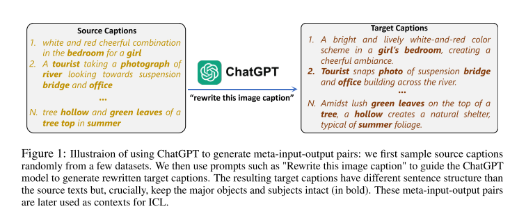| [[Github](https://github.com/LijieFan/LaCLIP)]   [[Paper](https://arxiv.org/pdf/2305.20088)] |
|    **Structure-CLIP: Towards Scene Graph Knowledge to Enhance Multi-modal Structured Representations**  |CLIP在结构化的文本-图像匹配上表现不够，如通过clip score并不能区别一张图是人咬狗和狗咬人. 作者认为造成这个问题的原因是CLIP在学习多模态场景中的representations时未能充分利用结构化知识.  文章提出 Structure-CLIP ，一个端到端的框架，通过集成场景图知识来增强多模态结构化表示.  🧟‍♂️: 1.增加难例负样本; 2. 实际工作中个人也想过类似方法，大概是通过分析负责描述的词性等，利用最短依赖路径等方法拆分句子，然后做enhance.| 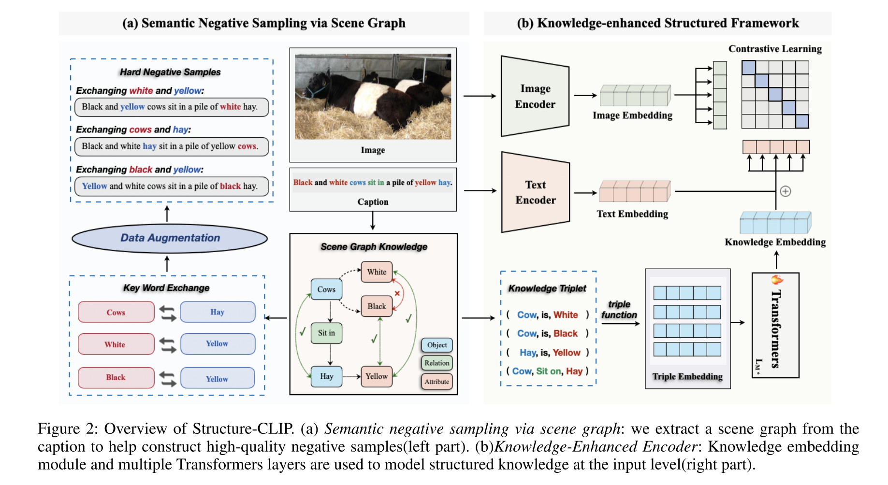 | [[Github](https://github.com/zjukg/Structure-CLIP)]   [[Paper](https://arxiv.org/pdf/2305.06152)] |
|    **WHEN AND WHY VISION-LANGUAGE MODELS BEHAVE LIKE BAGS-OF-WORDS, AND WHAT TO DO ABOUT IT?**  |  尽管VLM在下游任务表现不错，但对模型如何学习类别和属性的组合关系，目前尚不清楚.  文章首先提出一个Attribution, Relation, and Order(ARO) 的benchmark，系统评估VLM理解不同类型的关系、属性和顺序信息的能力. 然后对使用VLM实现的检索任务和对比预训练做了深刻解析，提出解释了几个问题. 最后提出NegCLIP提高模型对 attributes and relations的理解.   🧟‍♂️: ICLR 2023 Oral，初看觉得没什么意思，但精读后收获很多. 比如实际工作中，利用clip实现多模态检索，虽然clip不能很好的学习object和对应属性的关系，但通过触发key words，依旧可以获得很好的表现. 文章对此做了解读. 以及NegCLIP，方法直接简单，其实实际工作中常用类似方法. 总之是一篇值得细品的文章👍|  | [[Github](https://github.com/mertyg/vision-language-models-are-bows)]   [[Paper](https://openreview.net/pdf?id=KRLUvxh8uaX)] |
|2024|
|    **CLAP: Isolating Content from Style through Contrastive Learning with Augmented Prompts**  |直接使用[作者的回答](https://www.zhihu.com/question/660698707/answer/3550999896)： 从causality理论出发，CLAP旨在提升pretrained VLM在distribution shift场景下的generalization能力，CLAP仅需在text modality用较小成本去fine-tune CLIP模型，可以使pretrained representations更聚焦于content（object）本身，从而提升模型zero-shot/few-shot表现, 以及domain adaptation和adversarial resilience的能力.  |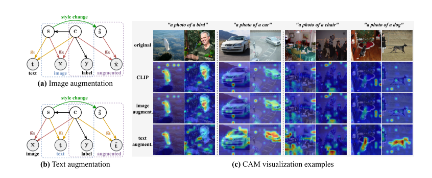| [[Github](https://github.com/YichaoCai1/CLAP)]   [[Paper](https://arxiv.org/pdf/2311.16445)] |
|    **TIC-CLIP: CONTINUAL TRAINING OF CLIP MODELS**   |随着数据的不断积累和更新，如何低成本的训练模型，与最新的数据同步. 文章提出一种简单的rehearsal-based的方案，与标准的预训练方法相比，提速2.5x. | 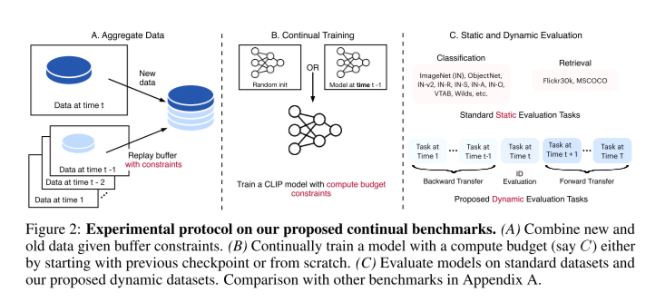| [[Github](https://github.com/apple/ml-tic-clip)]   [[Paper](https://arxiv.org/pdf/2310.16226)] |
|    **DEMYSTIFYING CLIP DATA[MetaCLIP]**  |文章揭示了CLIP训练数据的管理方法，提出CLIP数据管理算法，来简化和产生高质量的训练数据.  并且介绍了Metadata-Curated Language-Image Pre-training (MetaCLIP)---CLIP pro版.   🧟‍♂️:建议大规模数据集管理食用，数据质量比数量重要得多～| | [[Github](https://github.com/facebookresearch/MetaCLIP)]   [[Paper](https://arxiv.org/pdf/2309.16671)]|

## Improvement & Innovation

| Title | Abstract | Intro | Useful Links |
|:----| :---:| :----: | :---:|
|2022|
|    **AltCLIP: Altering the Language Encoder in CLIP for Extended Language Capabilities**  |文章提出一个概念上简单而有效的方法来训练一个强大的双语/多语多模态表示模型. 使用预训练的多语言文本编码器XLMR替换Clip的文本编码器，通过两阶段的训练模式(Teacher Learning; Contrastive Learning)对齐文本和图像表征. | 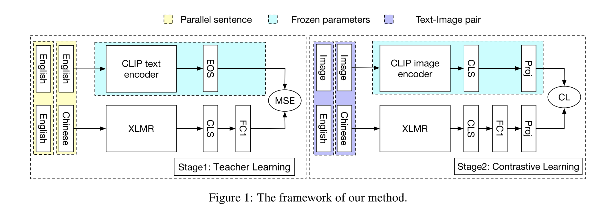 | [[Github](https://github.com/FlagAI-Open/FlagAI)]   [[Paper](https://arxiv.org/pdf/2211.06679)] |
|2023|
|    **CLIPPO: Image-and-Language Understanding from Pixels Only**  | 文章对使用纯基于像素的模型进行文本和图像的多模态学习进行探索。CLIPPO是一个单独的视觉 Transformer，它处理视觉输入或文本，或两者一起，所有都呈现为 RGB 图像（文本在空白图像上渲染，作为纯图像处理）. 所有模态都使用相同的模型参数，包括低级特征处理；也就是说，不存在特定于模态的初始卷积、tokenization 算法或输入嵌入表. CLIPPO仅用一个任务训练--对比学习. | 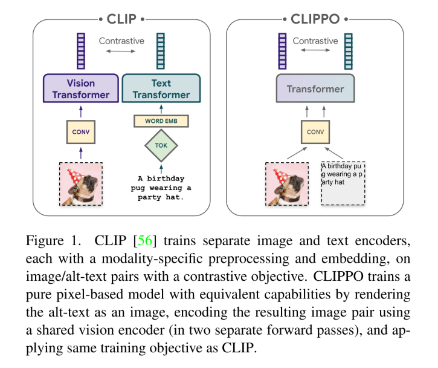 | [[Github](https://github.com/google-research/big_vision)]   [[Paper](https://arxiv.org/pdf/2212.08045)] |
|    **Alpha-CLIP: A CLIP Model Focusing on Wherever You Want**  |Clip无法关注到局部区域，针对此问题，文章提出一个增强版本的CLIP，名为Alpha-CLIP. Alpha-CLIP带有一个辅助alpha通道来提示注意区域，并通过构造数百万个RGBA区域-文本对进行了微调。Alpha-CLIP不仅保留了CLIP的视觉识别能力，而且可以精确控制图像内容的重点. 它证明了在各种任务中的有效性，包括但不限于开放世界识别、多模态大语言模型和条件2D /3D生成. 它具有强大的潜力，可作为图像相关任务的通用工具. | 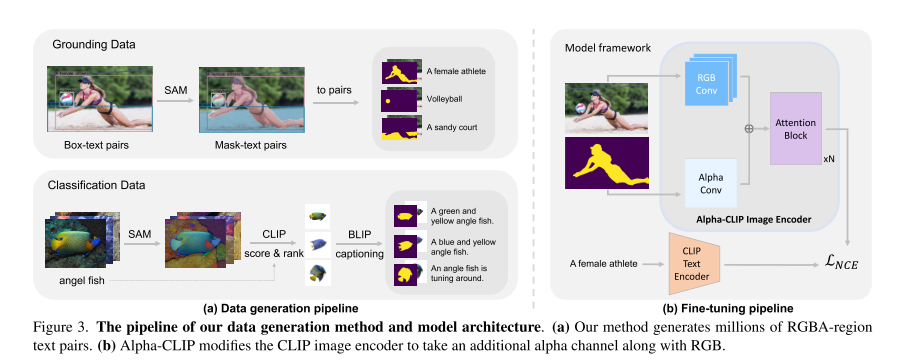 | [[Github](https://github.com/SunzeY/AlphaCLIP)]   [[Paper](https://arxiv.org/pdf/2312.03818)] |
|    **Chinese CLIP: Contrastive Vision-Language Pretraining in Chinese**  |文章提出中文CLIP预训练模型，并给出了两阶段预训练法: 1.将预训练Clip的图像编码器固定，使用中文RoBERTA替换文本编码器，训练RoBERTA; 2.文本、图像编码器同时训练.| 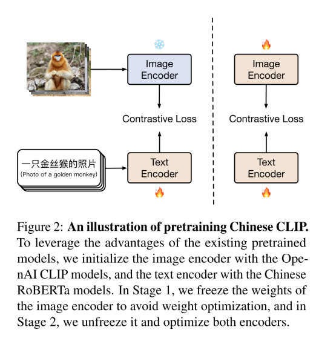 | [[Github](https://github.com/OFA-Sys/Chinese-CLIP)]   [[Paper](https://arxiv.org/pdf/2211.01335)] |
|    **EVA-CLIP: Improved Training Techniques for CLIP at Scale**  |大力出奇迹. | 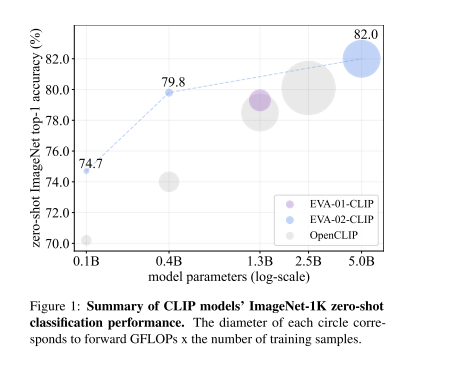 | [[Github](https://github.com/baaivision/EVA)]   [[Paper](https://arxiv.org/pdf/2303.15389)] |
|2024|
|    **EVA-CLIP-18B: Scaling CLIP to 18 Billion Parameters**  |大力出奇迹. | 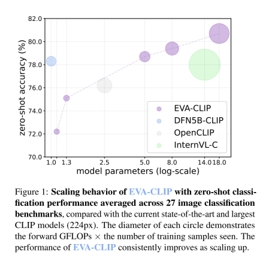 | [[Github](https://github.com/baaivision/EVA)]   [[Paper](https://arxiv.org/pdf/2402.04252)] |
|    **ACloser Look at the Explainability of Contrastive Language-Image Pre-training**  |文章发现了CLIP的可解释性有两个问题：1.可视化结果和人的感知是反的；2.可视化有非常多的噪声响应. 针对上述问题，文章阐述了原因，并给出一个train-free的解决方法.  🧟‍♂️:工作上遇到一个问题，使用clip做相似对对比，cos相似度基本都在0.2+，这篇论文给了答案，同时Cam图的结果提升也很大.👍 | 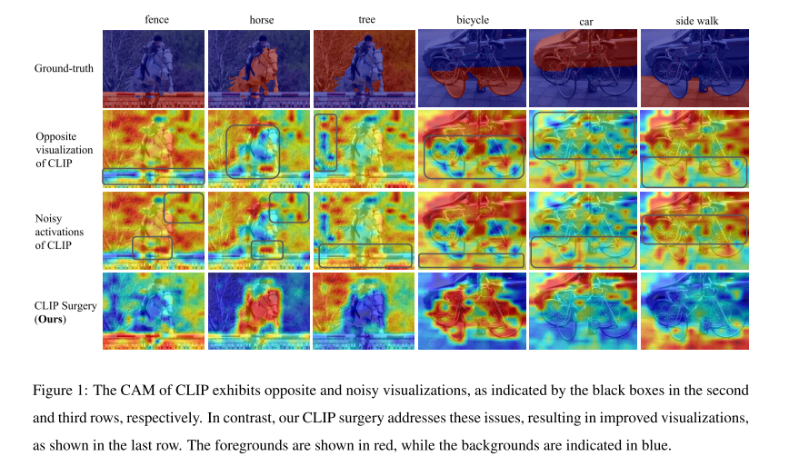 | [[Github](https://github.com/xmed-lab/CLIP_Surgery)]   [[Paper](https://arxiv.org/pdf/2304.05653)]  [[知乎](https://www.zhihu.com/question/595372017/answer/2982207851)]|
|    **Long-CLIP: Unlocking the Long-Text Capability of CLIP**  | CLIP的文本token长度被限制为77，而研究表明实际有效长度甚至不到20. 这使得CLIP无法处理详细的描述,限制了其在图像检索和文本到图像生成方面的应用. 本文提出Long-CLIP作为CLIP的即插即用替代方案，它支持长文本输入，保留甚至超越其zero-shot的泛化能力，并调整CLIP潜在空间，使其易于取代CLIP，而无需在下游框架中进行任何进一步的调整.| 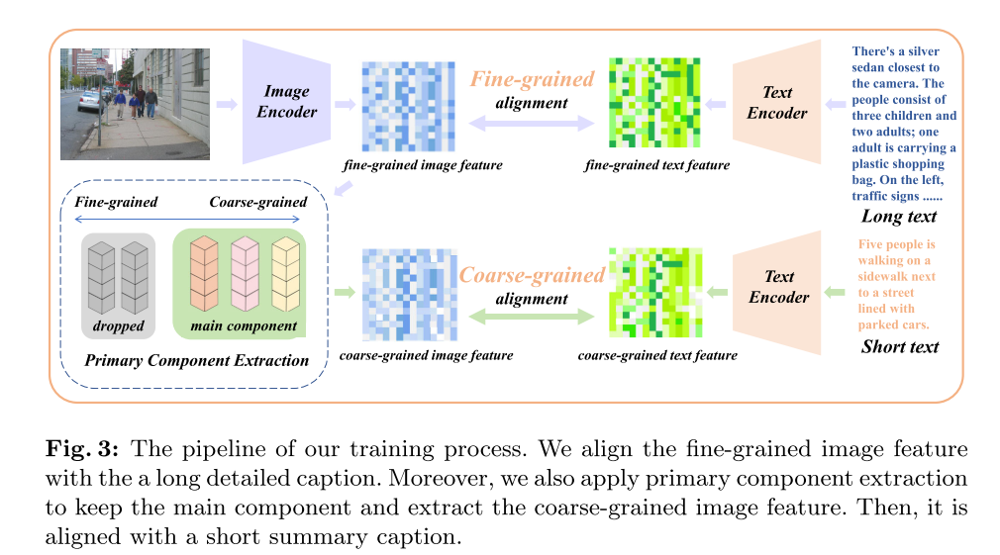 | [[Github](https://github.com/beichenzbc/Long-CLIP)]   [[Paper](https://arxiv.org/pdf/2403.15378)]|
|    **MobileCLIP: Fast Image-Text Models through Multi-Modal Reinforced Training**  | 文章提出了mobile版的CLIP，与标准的ViT-B/16 CLIP相比，速度提升2.3倍，在38个测试集上accuracy平均提高2.9%. 与标准CLIP相比，训练效率提升10-1000倍. 主要的一些点包括: 文本/图像encoder的重新选择和设计、借助CoCa对训练集生成多个caption进行数据集增强、多个大模型（CLIP）的Model ensembling，以及基于此设计的loss.| 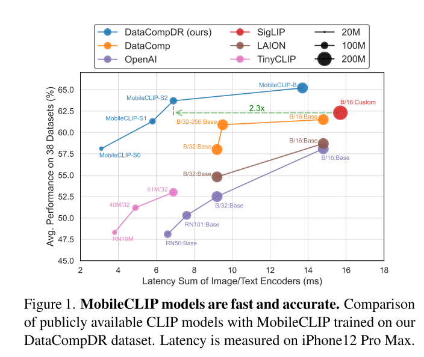 | [[Github](https://github.com/apple/ml-mobileclip)]   [[Paper](https://arxiv.org/pdf/2311.17049)]|

## Data

| Title | Abstract | Intro | Useful Links |
|:----| :---:| :----: | :---:|
|2024|
|    **VeCLIP: Improving CLIP Training via Visual-enriched Captions**  | 针对网络爬虫的文本-图像数据对，进行caption重写。使用LLaVA生成caption，然后与爬虫得到的描述（AltTexts）做融合，送入Vicuna-1.1得到重写后的caption.  |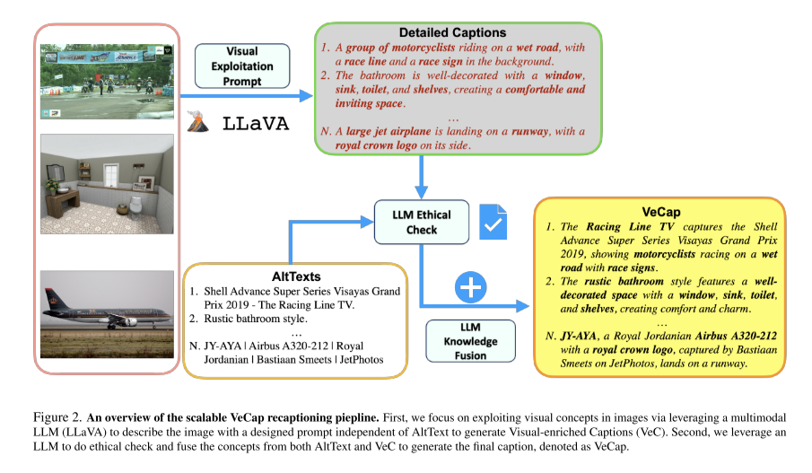|  [[Github](https://github.com/apple/ml-veclip)]   [[Paper](https://arxiv.org/pdf/2310.07699)] |
|    **SynthCLIP: Are We Ready for a Fully Synthetic CLIP Training?**  | 使用全合成文本图像对训练 CLIP 模型，与先前依赖于真实数据的方法有显著区别，SynthCLIP 实现了与在真实数据集上训练的 CLIP 模型相媲美的性能.  |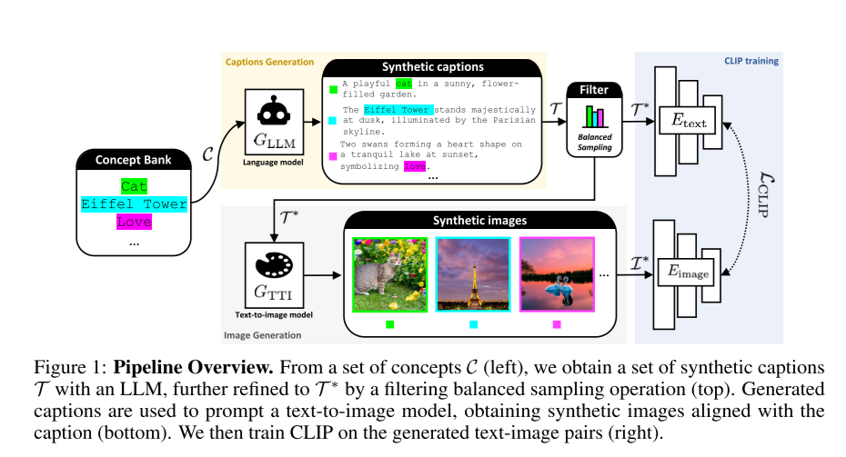|  [[Github](https://github.com/hammoudhasan/SynthCLIP)]   [[Paper](https://arxiv.org/pdf/2402.01832)] |

## Distillation

| Title | Abstract | Intro | Useful Links |
|:----| :---:| :----: | :---:|
|2023|
|    **TinyCLIP: CLIP Distillation via Affinity Mimicking and Weight Inheritance**  |文章提出了一种面向大规模语言图像预训练模型的跨模态蒸馏方法:TinyCLIP. TinyClip包括两个核心技术: affinity mimicking and weight inheritance. 基于多级渐进式方案进行affinity mimicking和Weight inheritance，完成Clip模型的压缩及性能保真，在速度和准确度上做了较好的平衡. | 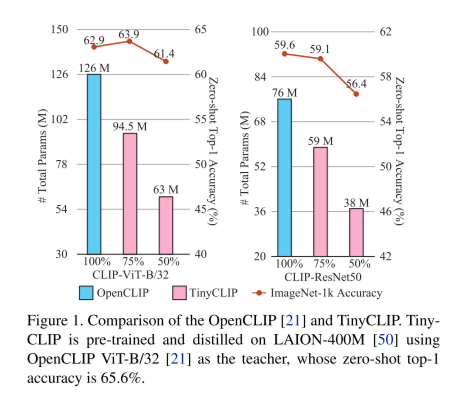 | [[Github](https://github.com/microsoft/Cream/tree/main/TinyCLIP)]   [[Paper](https://arxiv.org/pdf/2211.01335)] |
|2024|
|    **CLIP-KD: An Empirical Study of CLIP Model Distillation**  |文章核心目的是利用一个大型的教师CLIP模型来监督一个小型的学生CLIP模型，使得学生CLIP模型可以在保持轻量的前提下显著提升性能. 文章从关系、特征、梯度和对比模式的角度来检验CLIP-知识蒸馏的有效性 . 最后的消融实验表明，使用简单的MSE进行特征蒸馏实现了最好的蒸馏性能. | 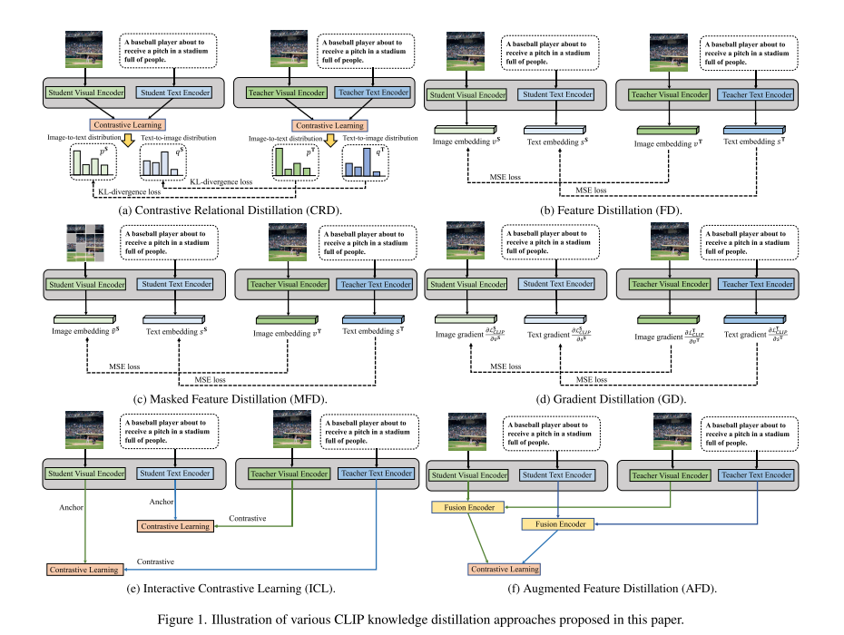 | [[Github](https://github.com/winycg/CLIP-KD)]   [[Paper](https://arxiv.org/pdf/2307.12732)] |

## Loss

| Title | Abstract | Intro | Useful Links |
|:----| :---:| :----: | :---:|
|2022|
|    **CYCLIP: Cyclic Contrastive Language-Image Pretraining**  |Clip的目标函数仅使用了跨模态的对比loss，对于单个模态内部和跨模态的i2t、t2i的对称性约束稍显不足，可能会导致图像和文本之前的inconsistent predictions. 如果对称化两个不匹配的图像-文本对之间的相似性以及图像-图像对和文本-文本对之间的相似性，则可以消除图像和文本空间中的不一致（看图片更好理解）. 论文提出了cross-modal consistency和in-modal consistency两种loss，与标准clip相比，在下游的zero-shot分类任务中，准确率有10% − 24%的提升. |  | [[Github](https://github.com/goel-shashank/CyCLIP)]   [[Paper](https://arxiv.org/pdf/2205.14459)] |
|2023|
|    **SigLip:Sigmoid Loss for Language Image Pre-Training**  |文章提出了一种用于语言图像预训练（SigLIP）的简单成对 Sigmoid 损失. 与使用 Softmax 归一化的标准对比学习不同，Sigmoid 损失仅对图像-文本对进行操作，并且不需要对归一化的成对相似性进行全局视图.  Sigmoid 损失同时允许进一步扩大批量大小，同时在较小的批量大小下也能表现更好. | 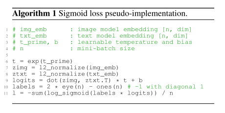 | [[Github](https://github.com/google-research/big_vision)]   [[Paper](https://arxiv.org/pdf/2303.15343)] |

## Zero-Shot & Few-Shot & Classification

| Title | Abstract | Intro | Useful Links |
|:----| :---:| :----: | :---:|
|2021|
|    **CLIP-Adapter: Better Vision-Language Models with Feature Adapters**  | CLIP Adapter是一个为few-shot classfication任务设计的一个插入式模块.在冻住的clip特征上添加一个残差连接的微调器，使得CLIP能更好地应对分类等下游任务.|| [[Github](https://github.com/gaopengcuhk/CLIP-Adapter)]   [[Paper](https://arxiv.org/pdf/2110.04544)] |
|2022|
|    **Tip-Adapter: Training-free Adaption of CLIP**  |为了提高Clip的few-shot能力，文章提出一种免训练的方法，、名为Tip-Adapter. 通过从少样本监督中构建query-key缓存模型来获取适配器的权重. 通过缓存模型，与传统的finetune方法相比，Tip-Adapter表现出极高的效率. |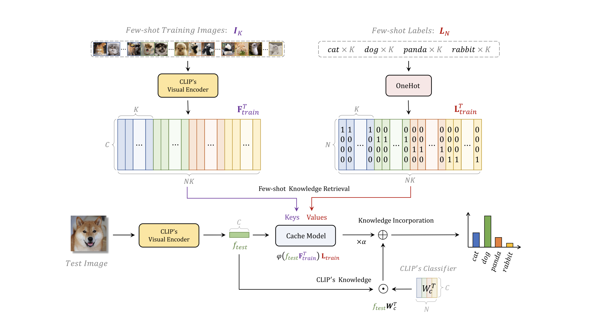| [[Github](https://github.com/gaopengcuhk/Tip-Adapter)]   [[Paper]( https://arxiv.org/pdf/2207.09519)]  |
|    **CALIP: Zero-Shot Enhancement of CLIP with Parameter-free Attention**  | 文章出发点是如何在不finetune的情况下，提升clip在下游任务上的zero-shot能力.文章提出了一种parameter-free的注意力模块(CALIP)，引导视觉和文本表示相互交互，并通过注意力探索跨模式信息特征.通过这种方式，图像与文本两个模态特征相互感知，以实现更好的自适应零样本对齐.|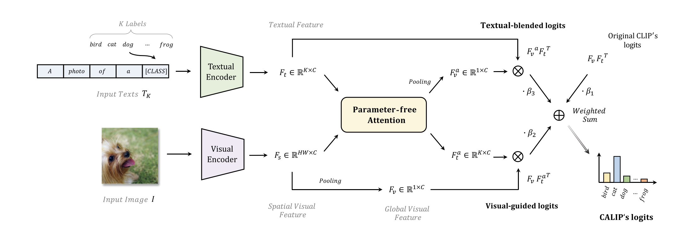| [[Github](https://github.com/ZiyuGuo99/CALIP)]   [[Paper](https://arxiv.org/pdf/2209.14169)]  |
|      **CoOp: Learning to Prompt for Vision-Language Models**  | 受NLP领域prompt learning的启发，文章提出了Context Optimization(CoOp)，用于将类CLIP式的视觉语言模型迁移到下游图像识别任务.具体而言，CoOp将预训练模型参数freeze，使用可学习向量对提示的上下文单词进行建模.作者在11个下游任务上验证CoOp的有效性，结果显示CoOp的性能明显好于原始预训练模型如CLIP.|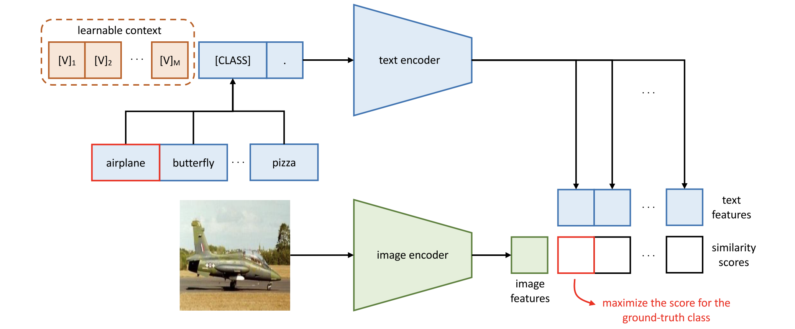| [[Github](https://github.com/KaiyangZhou/CoOp)]   [[Paper](https://arxiv.org/pdf/2109.01134)] |
|      **CoCoOp: Conditional Prompt Learning for Vision-Language Models**  |针对CoOp泛化性差的问题，即:学习到的上下文对数据集中unseen classes的泛化性不好.文章提出Conditional Context Optimization (CoCoOp)，在CoOp基础上，引入一个轻量级的网络，名为Meta-Net:为每张图像生成input-conditional tokens. input-conditional tokens与 CoOp中的learnable vectors叠加，共同参与训练.大量实验表明，对于unseen classes，CoCoOp 比 CoOp 的泛化能力要好得多，甚至显示出超越单个数据集的可迁移性， 并产生更强的领域泛化性能 |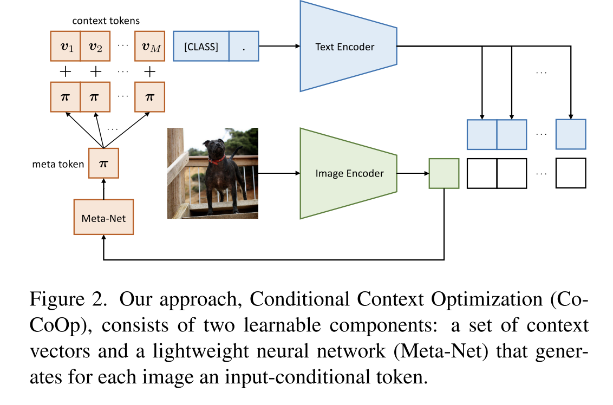| [[Github](https://github.com/KaiyangZhou/CoOp)]   [[Paper](https://arxiv.org/pdf/2203.05557)] |
|      **CLIP Itself is a Strong Fine-tuner:Achieving 85.7% and 88.0% Top-1 Accuracy with ViT-B and ViT-L on ImageNet**  | 文章通过一系列试验，验证使用不同超参数finetune clip后在下游分类任务的表现.  |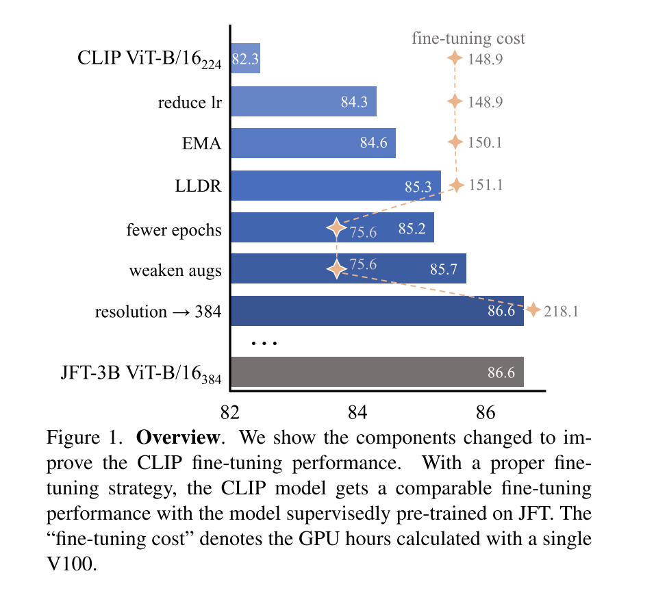| [[Github](https://github.com/LightDXY/FT-CLIP)]   [[Paper](https://arxiv.org/pdf/2212.06138)] |
|     **CLIPN for Zero-Shot OOD Detection: Teaching CLIP to Say No**  | 文章的motivation是通过向CLIP提供positive的语义提示和negative的语义提示，以此让CLIP拥有区分OOD（Out-of-distribution）和ID（in-distribution）样本的能力。具体来说,文章设计了一个可学习的"否定"提示及一个针对"否定"的文本编码器,以捕捉图像中的否定语义.|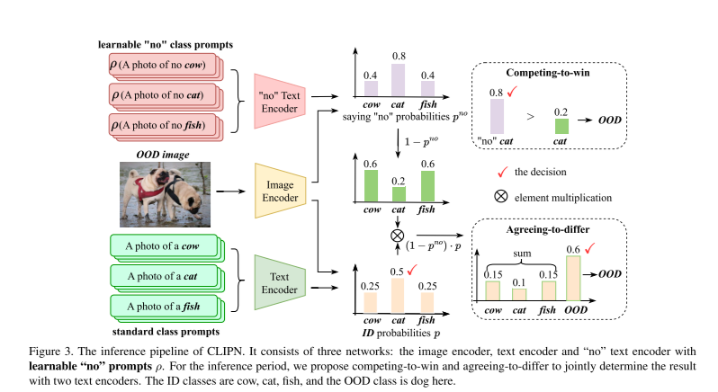| [[Github](https://github.com/xmed-lab/CLIPN)]   [[Paper](https://arxiv.org/pdf/2308.12213v2)] |
|     **MaPLe: Multi-modal Prompt Learning**  |诸如CLIP的VLM模型，对文本提示很敏感，需要仔细选择prompt才能发挥良好作用.  针对下游任务，近期比较常用学习提示作为文本输入的方案（learn prompts）微调CLIP.  作者认为只在单个branch中使用提示来调整 CLIP的表示并不是最优的，因为它不允许灵活地动态调整下游任务的两个表示空间.  为解决这个问题，作者提出了MaPLe，在image和text两个分支都进行prompt learning，提高两个模态的表征一致性. 与CoCoOp 相比，MaPLe 表现出了良好的性能，在 11 个不同的图像识别数据集性能平均明显提升. |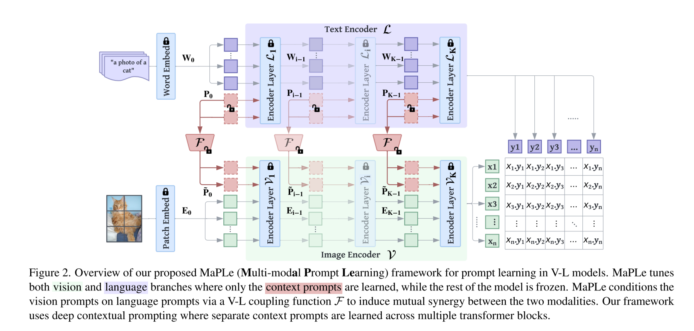| [[Github](https://github.com/muzairkhattak/multimodal-prompt-learning)]   [[Paper](https://arxiv.org/pdf/2210.03117)] |
|2024|
|    **AMU-Tuning: Effective Logit Bias for CLIP-based Few-shot Learning**  | 提出了一种名为AMU-Tuning的方法，用于改进基于CLIP模型的小样本学习性能. 该方法通过分析关键组件——logit特征、logit预测器和logit融合——来学习有效的logit偏差，并通过利用辅助特征、多分支训练的特征初始化线性分类器以及基于不确定性的融合策略，将logit偏差有效地整合到CLIP中，以提高小样本分类的准确性. |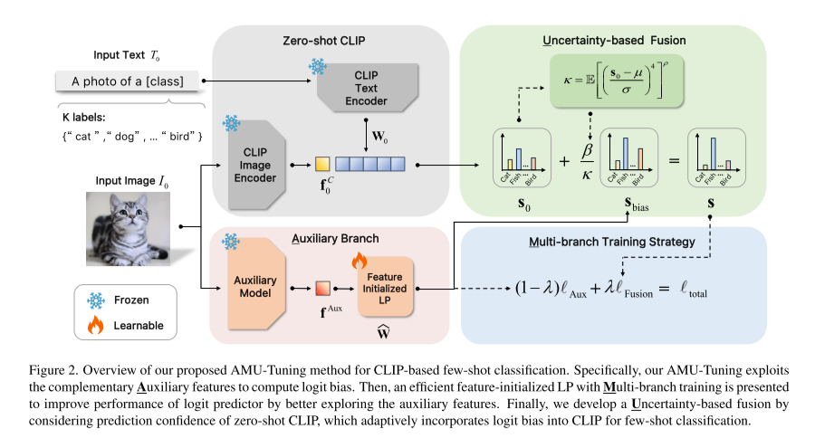| [[Github](https://github.com/TJU-sjyj/AMU-Tuning)]   [[Paper](https://arxiv.org/pdf/2404.089588)] |

## Retrieval

| Title | Abstract | Intro | Useful Links |
|:----| :---:| :----: | :---:|
|2023|
|    **Composed Image Retrieval using Contrastive Learning and Task-oriented CLIP-based Features**  | 使用clip进行检索. 分为两步：1.微调clip的text encoder 和image encoder；2.设计一个combiner，将两个模态特征fusion，用这个特征做retrieval. |   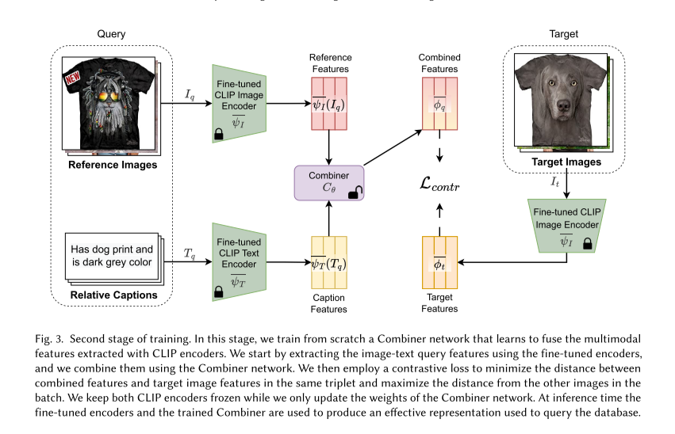| [[Github](https://github.com/ABaldrati/CLIP4Cir)]   [[Paper](https://arxiv.org/pdf/2308.11485)] |
|2024|
| **JINA CLIP: Your CLIP Model Is Also Your Text Retriever**  | 传统的text embedding模型，在文本到文本检索中出色，但无法执行cross-modal任务. 诸如Clip之类的模型，有效地对齐图像和文本嵌入，但由于其训练方法和上下文限制，因此未针对文本到文本检索进行优化. 文章提出了一种新颖的多任务对比训练方法，在单个模型中实现了state-of-the-art的文本到文本和文本到图像检索能力. |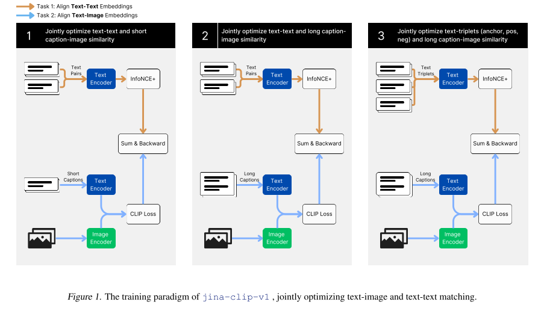   | [[huggingface](https://huggingface.co/jinaai/jina-clip-v1)]   [[Paper](https://arxiv.org/pdf/2405.20204))] |

## Segmentation

| Title | Abstract | Intro | Useful Links |
|:----| :---:| :----: | :---:|
|2022|
|    **DenseCLIP: Language-Guided Dense Prediction with Context-Aware Prompting**  | 文章提出一种新的框架，将clip的预训练知识迁移到下游分割、目标检测等密集任务. 作者将CLIP 中的图像-文本匹配问题转换为像素文本匹配问题，并使用像素-文本匹配问题，使用像素-文本匹配得分(pixel-text score maps)来指导密集预测模型的学习.  通过进一步使用图像中的上下文信息来提示语言模型，促进模型更好地利用预训练的知识. |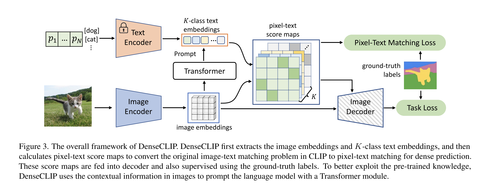| [[Github](https://github.com/raoyongming/DenseCLIP)]   [[Paper](https://arxiv.org/pdf/2112.01518)] |

## Captioning

| Title | Abstract | Intro | Useful Links |
|:----| :---:| :----: | :---:|
|2021|
|    **ClipCap: CLIP Prefix for Image Captioning**  | 作者提出了CLIPCap模型来生成image captions.具体而言，借助CLIP提取图像embeadding，训练一个mapping network，为每一个caption生成前缀.直接和caption embedding 做结合（concatenation），形成新的embedding，送入GPT-2生成captions. |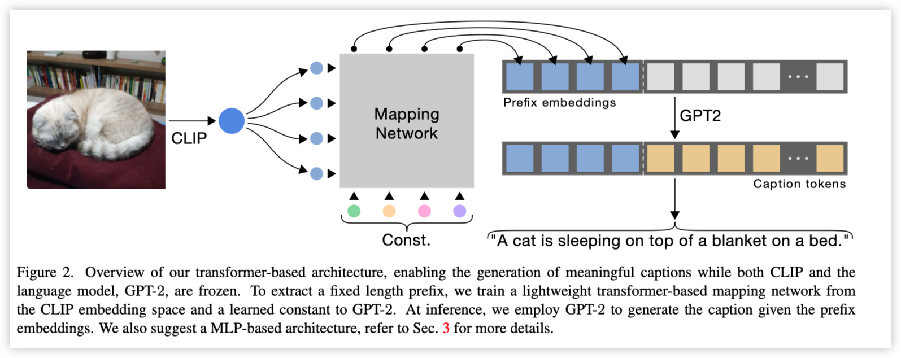| [[Github](https://github.com/rmokady/CLIP_prefix_caption)]   [[Paper](https://arxiv.org/pdf/2111.09734)] |
|2022|
|    **CapDec: Text-Only Training for Image Captioning using Noise-Injected CLIP**  | 文章认为，Clip模型的训练，就是将抽取的文本和图片特征尽可能相似. 基于这个观察，只需要设计一个decoder，仅利用文本数据学习如何将文本特征“翻译”到文本，即可实现图片captioning.   🧟‍♂️:脑洞很大，又很合理，喜欢这篇文章~👍|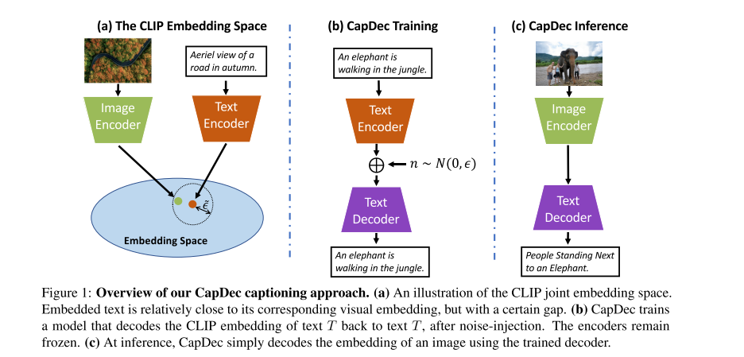| [[Github](https://github.com/DavidHuji/CapDec)]   [[Paper](https://arxiv.org/pdf/2211.00575)] |
|2023|
|    **DECAP: DECODING CLIP LATENTS FOR ZERO-SHOT CAPTIONING VIA TEXT-ONLY TRAINING**  |文章提出一个简单的框架来实现Zero-shot Captioning. clip的 text encoder作为输入，使用text-only数据训练一个text decoder。同时，为了解决多模态对比学习中的modality gap问题，作者将 image embedding 送入 text decoder 中解码，实现 Zero-shot Captioning.  |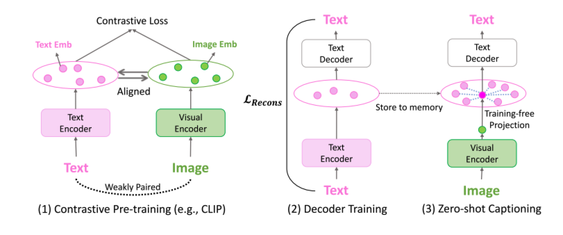| [[Github](https://github.com/dhg-wei/DeCap)]   [[Paper](https://openreview.net/pdf?id=Lt8bMlhiwx2)] |

## Other

| Title | Abstract | Intro | Useful Links |
|:----| :---:| :----: | :---:|
|2022|
|    **Democratizing Contrastive Language-Image Pre-training: A CLIP Benchmark of Data, Model, and Supervision**  | 文章提出CLIP-benchmark，是第一个对CLIP及其变体进行评估、分析和测试的基准. 同时，作者提出三个观点，1.数据质量对性能有很大影响；2..某些supervision对卷积网络（ConvNets）和视觉变换器（ViT）有不同的影响. 适当的supervision可以有效地提高CLIP的性能; 3.减少文本编码器可以降低训练成本，但对最终性能影响不大.  此外，作者将DeCLIP与FLIP结合，得到一个性能较好的CLIP变体: DeFILIP.|| [[Github](https://github.com/Sense-GVT/DeCLIP)]   [[Paper](https://arxiv.org/pdf/2203.05796)] |
|    **Exploring CLIP for Assessing the Look and Feel of Images**  | 借助CLIP做IQA，文章实验证明，CLIP 捕获了有意义的priors，可以很好地推广到不同的感知评估 . | 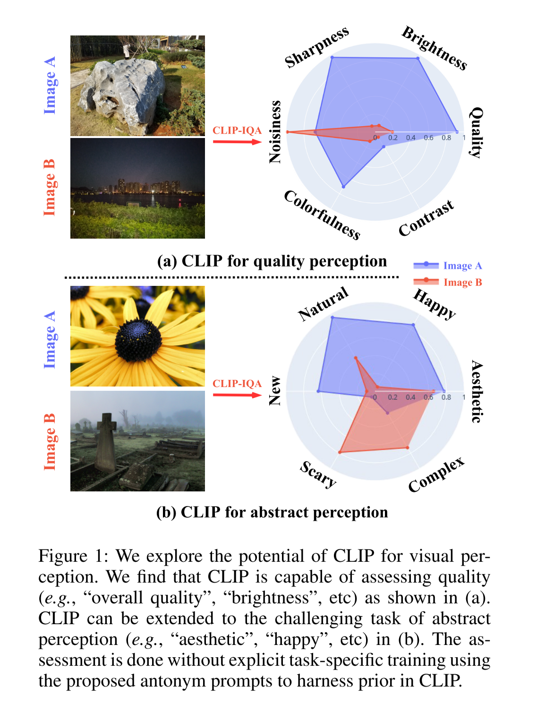 | [[Github](https://github.com/IceClear/CLIP-IQA)]   [[Paper](https://arxiv.org/pdf/2207.12396)] |
|2024|
|    **CLIPCleaner: Cleaning Noisy Labels with CLIP**  | 文章首次提出利用 VL模型进行样本选择来解决噪声标签学习 (LNL) 问题.  作者使用CLIP，借助其天然的多模态和zero-shot能力，提出一种CLIPCleaner的方法来进行样本选择，并从理论和经验上证实了其有效性（大量公式警告） . | 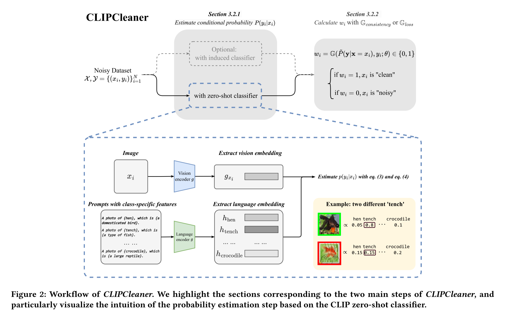 | [[Github](https://github.com/MrChenFeng/CLIPCleaner_ACMMM2024)]   [[Paper](https://www.arxiv.org/pdf/2408.10012)] |

