# Awesome-CLIP

- [Awesome-CLIP](#awesome-clip)
  - [Train](#train)
  - [Improvement \& Innovation](#improvement--innovation)
  - [Data](#data)
  - [Distillation](#distillation)
  - [Loss](#loss)
  - [Zero-Shot \& Few-Shot \& Classification](#zero-shot--few-shot--classification)
  - [Retrieval](#retrieval)
  - [Detection](#detection)
  - [Segmentation](#segmentation)
  - [Captioning](#captioning)
  - [Generation](#generation)
  - [Video](#video)
  - [Other](#other) 

## Train

| Title | Abstract | Intro | Useful Links |
|:----| :---:| :----: | :---:|
|2022|
|    **SUPERVISION EXISTS EVERYWHERE: A DATA EFFICIENT CONTRASTIVE LANGUAGE-IMAGE PRE-TRAINING PARADIGM**  | 本文提出一种创新的CLIP训练方式--Data efficient CLIP (DeCLIP)，来解决CLIP训练对文本-图像pair数据量的需求.  核心思想就是增加对图像-文本对的supervision(增加更多约束)，更有效地学习通用的视觉特征. 作者增加了以下监督：1.每个模态内的self-supervision;2.跨模态的多视图supervision(数据增强后的view);3.来自其他相似对的最近邻supervision.  实验证明，与base CLIP相比，更少的训练数据取得了更高的表现.    🧟‍♂️:Nearest-Neighbor Supervision处设计了一个FIFO的队列，个人觉得借鉴了MoCo的思想，很有意思👍 || [[Github](https://github.com/Sense-GVT/DeCLIP)]   [[Paper](https://arxiv.org/pdf/2110.05208)] |
|2023|
| **Less is More: Removing Text-regions Improves CLIP Training Efficiency and Robustness**  | CLIP没有区分嵌入在图像中的文本区域的视觉语义和意义. 当嵌入区域中的文本与图像的视觉外观不匹配时，这可能导致不鲁棒性. 文章提出两种有效的方法来提高CLIP训练的效率和鲁棒性：1. 在保持相同数量的优化步骤的同时增强训练数据集；2.过滤掉图像中包含文本区域的样本.  在ImageNet和CoCo等数据集上测试，文章方法提高了Clip在下游任务的分类和检索准确率.  || [[Paper](https://arxiv.org/pdf/2305.05095)] |
|    **CLIPA: An Inverse Scaling Law for CLIP Training**  | 文章提出了一个令人惊讶的发现，即CLIP训练存在inverse scaling law，即使用的图像/文本编码器越大，可以用于训练的图像/文本tokens的序列长度越短. 此外，减少图像/文本tokens长度的策略，在确定这种缩放定律的质量方面起着至关重要的作用. 文章在有限的资源下成功训练了Clip. || [[Github](https://github.com/UCSC-VLAA/CLIPA)]   [[Paper](https://arxiv.org/pdf/2305.07017)] |
|    **CLIPA-v2: Scaling CLIP Training with 81.1% Zero-shot ImageNet Accuracy within a $10,000 Budget; An Extra $4,000 Unlocks 81.8% Accuracy**  | 在CLIPA基础上，验证了full resolution 的token微调模型时，inverse scaling law也适用;同时验证各种不同训练参数下模型的能力，包括模型大小、数据和training schedule. || [[Github](https://github.com/UCSC-VLAA/CLIPA)]   [[Paper](https://arxiv.org/pdf/2306.15658)] |
|    **Scaling Language-Image Pre-training via Masking**  | 文章提出了一种简单而有效的CLIP训练方法---FLIP（Fast Language-Image Pre-training）.该方法只需要在训练时随机Mask掉一部分图像. 实验证明，与标准CLIP详细，该方法在训练速度和模型精度方面都有提升. 文章受到MAE的启发. 引入masking，使模型在“how carefully we look at a sample pair” 和 “how many sample pairs we can process”之间做trade-off. 因为Vit encoder只用于visible patches，当mask掉一部分图像时，可以节约相应的显存，这样降低了计算量，可以使用更大的batchsize，对contrastive loss更加友好.  同时，masking作为一种形式的噪声和正则化可以提高鲁棒性.  || [[Github](https://github.com/facebookresearch/flip)]   [[Paper](https://arxiv.org/pdf/2212.00794)] |
|    **Improving CLIP Training with Language Rewrites**  | 在CLIP训练过程中，只对图像数据做了数据增强，而文本数据保持不变. 针对此问题，作者提出了Language augmented CLIP (LaCLIP), 利用LLM的上下文学习能力，重新描述训练集的captions，增加文本的多样性. 实验表明，在下游zero-shot任务上，性能有明显提升.|| [[Github](https://github.com/LijieFan/LaCLIP)]   [[Paper](https://arxiv.org/pdf/2305.20088)] |
|    **Structure-CLIP: Towards Scene Graph Knowledge to Enhance Multi-modal Structured Representations**  |CLIP在结构化的文本-图像匹配上表现不够，如通过clip score并不能区别一张图是人咬狗和狗咬人. 作者认为造成这个问题的原因是CLIP在学习多模态场景中的representations时未能充分利用结构化知识.  文章提出 Structure-CLIP ，一个端到端的框架，通过集成场景图知识来增强多模态结构化表示.   🧟‍♂️: 1.增加难例负样本; 2. 实际工作中个人也想过类似方法，大概是通过分析负责描述的词性等，利用最短依赖路径等方法拆分句子，然后做enhance.|  | [[Github](https://github.com/zjukg/Structure-CLIP)]   [[Paper](https://arxiv.org/pdf/2305.06152)] |
|    **WHEN AND WHY VISION-LANGUAGE MODELS BEHAVE LIKE BAGS-OF-WORDS, AND WHAT TO DO ABOUT IT?**  |  尽管VLM在下游任务表现不错，但对模型如何学习类别和属性的组合关系，目前尚不清楚.  文章首先提出一个Attribution, Relation, and Order(ARO) 的benchmark，系统评估VLM理解不同类型的关系、属性和顺序信息的能力. 然后对使用VLM实现的检索任务和对比预训练做了深刻解析，提出解释了几个问题. 最后提出NegCLIP提高模型对 attributes and relations的理解.    🧟‍♂️: ICLR 2023 Oral，初看觉得没什么意思，但精读后收获很多. 比如实际工作中，利用clip实现多模态检索，虽然clip不能很好的学习object和对应属性的关系，但通过触发key words，依旧可以获得很好的表现. 文章对此做了解读. 以及NegCLIP，方法直接简单，其实实际工作中常用类似方法. 总之是一篇值得细品的文章👍| 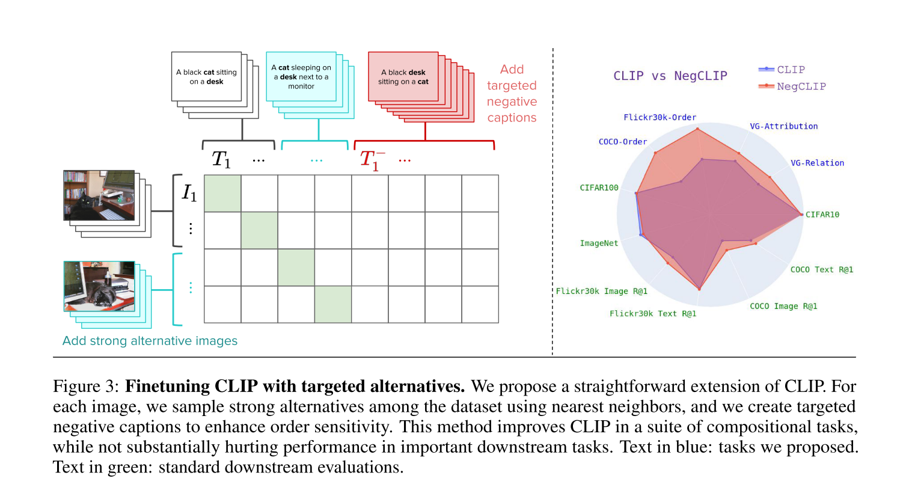 | [[Github](https://github.com/mertyg/vision-language-models-are-bows)]   [[Paper](https://openreview.net/pdf?id=KRLUvxh8uaX)] |
|2024|
|    **CLAP: Isolating Content from Style through Contrastive Learning with Augmented Prompts**  |直接使用[作者的回答](https://www.zhihu.com/question/660698707/answer/3550999896)： 从causality理论出发，CLAP旨在提升pretrained VLM在distribution shift场景下的generalization能力，CLAP仅需在text modality用较小成本去fine-tune CLIP模型，可以使pretrained representations更聚焦于content（object）本身，从而提升模型zero-shot/few-shot表现, 以及domain adaptation和adversarial resilience的能力.  || [[Github](https://github.com/YichaoCai1/CLAP)]   [[Paper](https://arxiv.org/pdf/2311.16445)] |
|    **TIC-CLIP: CONTINUAL TRAINING OF CLIP MODELS**   |随着数据的不断积累和更新，如何低成本的训练模型，与最新的数据同步. 文章提出一种简单的rehearsal-based的方案，与标准的预训练方法相比，提速2.5x. | | [[Github](https://github.com/apple/ml-tic-clip)]   [[Paper](https://arxiv.org/pdf/2310.16226)] |
|    **DEMYSTIFYING CLIP DATA[MetaCLIP]**  |文章揭示了CLIP训练数据的管理方法，提出CLIP数据管理算法，来简化和产生高质量的训练数据.  并且介绍了Metadata-Curated Language-Image Pre-training (MetaCLIP)---CLIP pro版.    🧟‍♂️:建议大规模数据集管理食用，数据质量比数量重要得多～| | [[Github](https://github.com/facebookresearch/MetaCLIP)]   [[Paper](https://arxiv.org/pdf/2309.16671)]|
|    **FINETUNING CLIP TO REASON ABOUT PAIRWISE DIFFERENCES**   |文章提出PC-CLIP (Pairwise Comparison CLIP)，提高CLIP推理差异的能力. 具体而言，借助LLM得到图片之间差异的文本描述，text encoder将上述描述编码，同时image encoder分别编码两张图片，计算image embedding的差异，对齐两个模态的差异. | 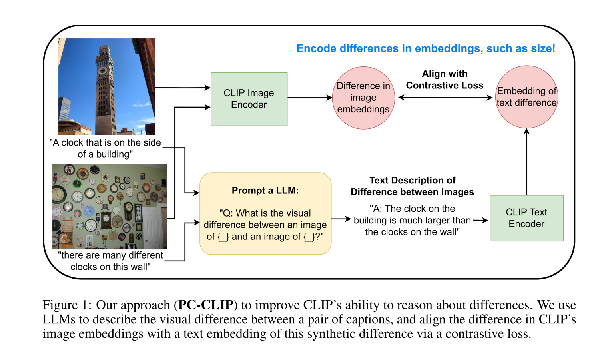| [[Github](https://github.com/dsam99/pc_clip)]   [[Paper](https://arxiv.org/pdf/2409.09721)] |
| **FFF: Fixing Flawed Foundations in contrastive pre-training results in very strong Vision-Language models**   |噪声和Caption的质量对VLM模型的训练十分重要. 文章首先研究分析了影响训练的两个因素：负样本的错误分配，以及质量的Caption和多样性较低. 针对以上问题，作者提出了一种基于图像-文本、图像-图像和文本-文本的positive pair的相似性挖掘算法，减少训练数据中由于语义相似的图像或是相似描述而产生的false negative的数量.  额外的，作者建议使用sigmoid loss训练.  | 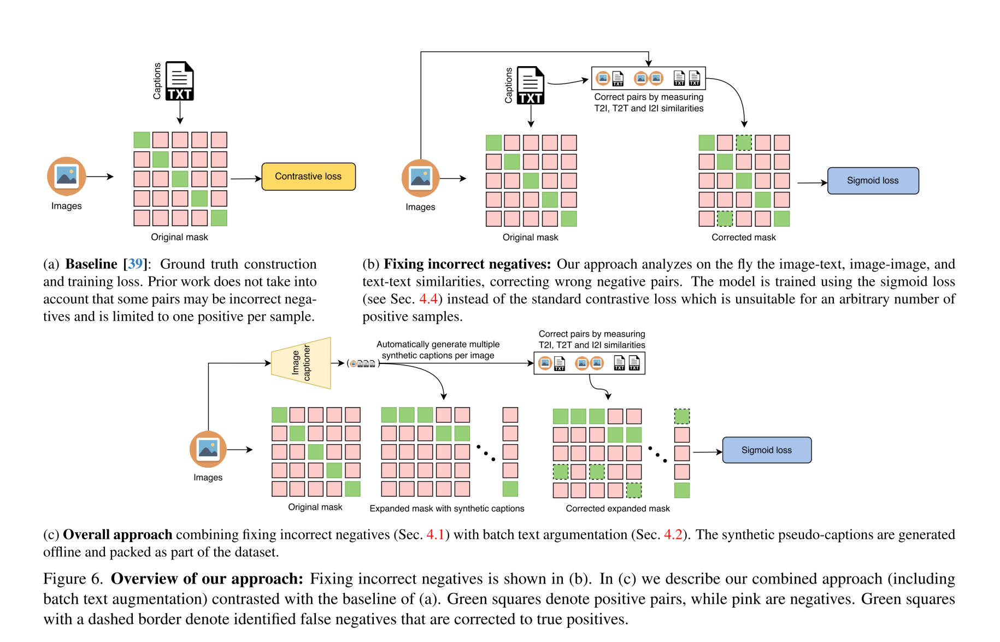| [[Paper](https://arxiv.org/pdf/2405.10286)] |

## Improvement & Innovation

| Title | Abstract | Intro | Useful Links |
|:----| :---:| :----: | :---:|
|2022|
|    **AltCLIP: Altering the Language Encoder in CLIP for Extended Language Capabilities**  |文章提出一个概念上简单而有效的方法来训练一个强大的双语/多语多模态表示模型. 使用预训练的多语言文本编码器XLMR替换Clip的文本编码器，通过两阶段的训练模式(Teacher Learning; Contrastive Learning)对齐文本和图像表征. |  | [[Github](https://github.com/FlagAI-Open/FlagAI)]   [[Paper](https://arxiv.org/pdf/2211.06679)] |
|2023|
|    **CLIPPO: Image-and-Language Understanding from Pixels Only**  | 文章对使用纯基于像素的模型进行文本和图像的多模态学习进行探索。CLIPPO是一个单独的视觉 Transformer，它处理视觉输入或文本，或两者一起，所有都呈现为 RGB 图像（文本在空白图像上渲染，作为纯图像处理）. 所有模态都使用相同的模型参数，包括低级特征处理；也就是说，不存在特定于模态的初始卷积、tokenization 算法或输入嵌入表. CLIPPO仅用一个任务训练--对比学习. |  | [[Github](https://github.com/google-research/big_vision)]   [[Paper](https://arxiv.org/pdf/2212.08045)] |
|    **Alpha-CLIP: A CLIP Model Focusing on Wherever You Want**  |Clip无法关注到局部区域，针对此问题，文章提出一个增强版本的CLIP，名为Alpha-CLIP. Alpha-CLIP带有一个辅助alpha通道来提示注意区域，并通过构造数百万个RGBA区域-文本对进行了微调。Alpha-CLIP不仅保留了CLIP的视觉识别能力，而且可以精确控制图像内容的重点. 它证明了在各种任务中的有效性，包括但不限于开放世界识别、多模态大语言模型和条件2D /3D生成. 它具有强大的潜力，可作为图像相关任务的通用工具. |  | [[Github](https://github.com/SunzeY/AlphaCLIP)]   [[Paper](https://arxiv.org/pdf/2312.03818)] |
|    **Chinese CLIP: Contrastive Vision-Language Pretraining in Chinese**  |文章提出中文CLIP预训练模型，并给出了两阶段预训练法: 1.将预训练Clip的图像编码器固定，使用中文RoBERTA替换文本编码器，训练RoBERTA; 2.文本、图像编码器同时训练.|  | [[Github](https://github.com/OFA-Sys/Chinese-CLIP)]   [[Paper](https://arxiv.org/pdf/2211.01335)] |
|    **EVA-CLIP: Improved Training Techniques for CLIP at Scale**  |大力出奇迹. |  | [[Github](https://github.com/baaivision/EVA)]   [[Paper](https://arxiv.org/pdf/2303.15389)] |
|2024|
|    **EVA-CLIP-18B: Scaling CLIP to 18 Billion Parameters**  |大力出奇迹. |  | [[Github](https://github.com/baaivision/EVA)]   [[Paper](https://arxiv.org/pdf/2402.04252)] |
|    **ACloser Look at the Explainability of Contrastive Language-Image Pre-training**  |文章发现了CLIP的可解释性有两个问题：1.可视化结果和人的感知是反的；2.可视化有非常多的噪声响应. 针对上述问题，文章阐述了原因，并给出一个train-free的解决方法.   🧟‍♂️:工作上遇到一个问题，使用clip做相似对对比，cos相似度基本都在0.2+，这篇论文给了答案，同时Cam图的结果提升也很大.👍 |  | [[Github](https://github.com/xmed-lab/CLIP_Surgery)]   [[Paper](https://arxiv.org/pdf/2304.05653)]  [[知乎](https://www.zhihu.com/question/595372017/answer/2982207851)]|
|    **Long-CLIP: Unlocking the Long-Text Capability of CLIP**  | CLIP的文本token长度被限制为77，而研究表明实际有效长度甚至不到20. 这使得CLIP无法处理详细的描述,限制了其在图像检索和文本到图像生成方面的应用. 本文提出Long-CLIP作为CLIP的即插即用替代方案，它支持长文本输入，保留甚至超越其zero-shot的泛化能力，并调整CLIP潜在空间，使其易于取代CLIP，而无需在下游框架中进行任何进一步的调整.|  | [[Github](https://github.com/beichenzbc/Long-CLIP)]   [[Paper](https://arxiv.org/pdf/2403.15378)]|
|    **MobileCLIP: Fast Image-Text Models through Multi-Modal Reinforced Training**  | 文章提出了mobile版的CLIP，与标准的ViT-B/16 CLIP相比，速度提升2.3倍，在38个测试集上accuracy平均提高2.9%. 与标准CLIP相比，训练效率提升10-1000倍. 主要的一些点包括: 文本/图像encoder的重新选择和设计、借助CoCa对训练集生成多个caption进行数据集增强、多个大模型（CLIP）的Model ensembling，以及基于此设计的loss.|  | [[Github](https://github.com/apple/ml-mobileclip)]   [[Paper](https://arxiv.org/pdf/2311.17049)]|
|    **RWKV-CLIP: A Robust Vision-Language Representation Learner**  | 本文从数据和模型架构的角度进一步探讨了 CLIP.  同时为了解决噪声数据的问题，提高从互联网爬取的大规模图像-文本数据的质量，作者借助LLM，提出了一个多样化的描述生成框架；此外，作者将RWKV引入VLM中，将 Transformer 的有效并行训练与 RNN 的高效推理相结合. 实验证明其在多个下游任务中实现了最先进的性能.    🧟‍♂️: RWKV架构是国人（chinese）原创的，通过高效的线性扩展解决了 Transformer 中的内存瓶颈和二次扩展问题，同时保留了并行训练和强大扩展性的表现特性. 关于RWKV 可查阅[RWKV: Reinventing RNNs for the Transformer Era](https://arxiv.org/pdf/2305.13048)| 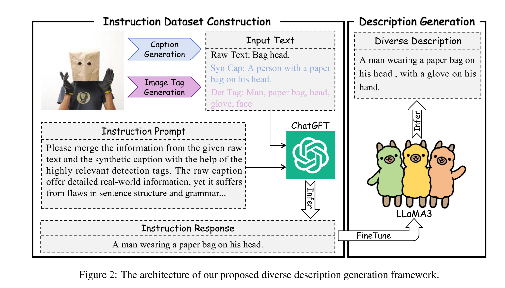   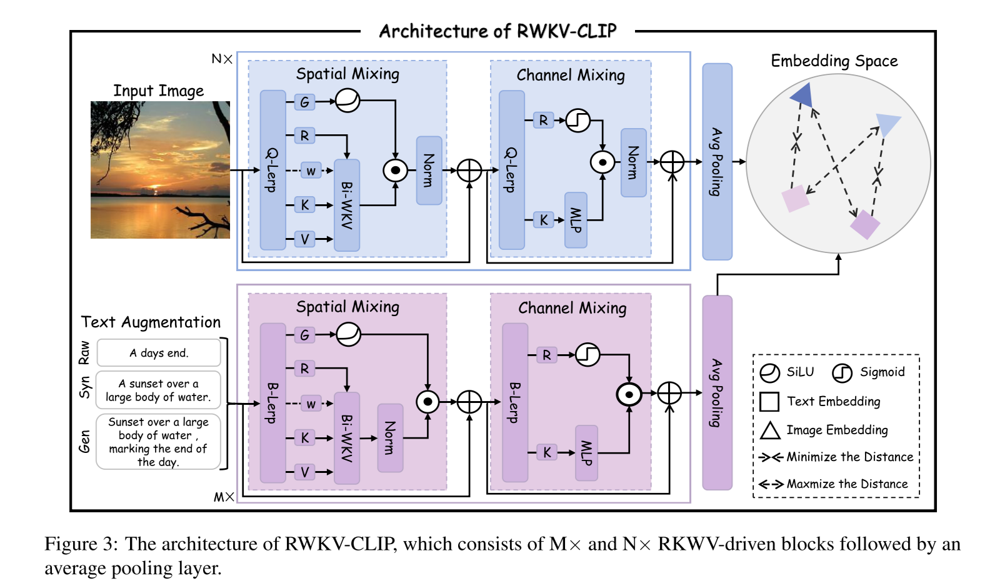 | [[Github](https://github.com/deepglint/RWKV-CLIP)]   [[Paper](https://arxiv.org/pdf/2406.06973)]|
|    **CLIP-Mamba: CLIP Pretrained Mamba Models with OOD and Hessian Evaluation**  | 利用CLIP方式训练Mamba . | | [[Github](https://github.com/raytrun/mamba-clip)]   [[Paper](https://arxiv.org/pdf/2404.19394)]|

## Data

| Title | Abstract | Intro | Useful Links |
|:----| :---:| :----: | :---:|
|2024|
|    **VeCLIP: Improving CLIP Training via Visual-enriched Captions**  | 针对网络爬虫的文本-图像数据对，进行caption重写。使用LLaVA生成caption，然后与爬虫得到的描述（AltTexts）做融合，送入Vicuna-1.1得到重写后的caption.  ||  [[Github](https://github.com/apple/ml-veclip)]   [[Paper](https://arxiv.org/pdf/2310.07699)] |
|    **SynthCLIP: Are We Ready for a Fully Synthetic CLIP Training?**  | 使用全合成文本图像对训练 CLIP 模型，与先前依赖于真实数据的方法有显著区别，SynthCLIP 实现了与在真实数据集上训练的 CLIP 模型相媲美的性能.  ||  [[Github](https://github.com/hammoudhasan/SynthCLIP)]   [[Paper](https://arxiv.org/pdf/2402.01832)] |

## Distillation

| Title | Abstract | Intro | Useful Links |
|:----| :---:| :----: | :---:|
|2023|
|    **TinyCLIP: CLIP Distillation via Affinity Mimicking and Weight Inheritance**  |文章提出了一种面向大规模语言图像预训练模型的跨模态蒸馏方法:TinyCLIP. TinyClip包括两个核心技术: affinity mimicking and weight inheritance. 基于多级渐进式方案进行affinity mimicking和Weight inheritance，完成Clip模型的压缩及性能保真，在速度和准确度上做了较好的平衡. |  | [[Github](https://github.com/microsoft/Cream/tree/main/TinyCLIP)]   [[Paper](https://arxiv.org/pdf/2211.01335)] |
|2024|
|    **CLIP-KD: An Empirical Study of CLIP Model Distillation**  |文章核心目的是利用一个大型的教师CLIP模型来监督一个小型的学生CLIP模型，使得学生CLIP模型可以在保持轻量的前提下显著提升性能. 文章从关系、特征、梯度和对比模式的角度来检验CLIP-知识蒸馏的有效性 . 最后的消融实验表明，使用简单的MSE进行特征蒸馏实现了最好的蒸馏性能. |  | [[Github](https://github.com/winycg/CLIP-KD)]   [[Paper](https://arxiv.org/pdf/2307.12732)] |

## Loss

| Title | Abstract | Intro | Useful Links |
|:----| :---:| :----: | :---:|
|2022|
|    **CYCLIP: Cyclic Contrastive Language-Image Pretraining**  |Clip的目标函数仅使用了跨模态的对比loss，对于单个模态内部和跨模态的i2t、t2i的对称性约束稍显不足，可能会导致图像和文本之前的inconsistent predictions. 如果对称化两个不匹配的图像-文本对之间的相似性以及图像-图像对和文本-文本对之间的相似性，则可以消除图像和文本空间中的不一致（看图片更好理解）. 论文提出了cross-modal consistency和in-modal consistency两种loss，与标准clip相比，在下游的zero-shot分类任务中，准确率有10% − 24%的提升. |  | [[Github](https://github.com/goel-shashank/CyCLIP)]   [[Paper](https://arxiv.org/pdf/2205.14459)] |
|2023|
|    **SigLip:Sigmoid Loss for Language Image Pre-Training**  |文章提出了一种用于语言图像预训练（SigLIP）的简单成对 Sigmoid 损失. 与使用 Softmax 归一化的标准对比学习不同，Sigmoid 损失仅对图像-文本对进行操作，并且不需要对归一化的成对相似性进行全局视图.  Sigmoid 损失同时允许进一步扩大批量大小，同时在较小的批量大小下也能表现更好. |  | [[Github](https://github.com/google-research/big_vision)]   [[Paper](https://arxiv.org/pdf/2303.15343)] |

## Zero-Shot & Few-Shot & Classification

| Title | Abstract | Intro | Useful Links |
|:----| :---:| :----: | :---:|
|2021|
|    **CLIP-Adapter: Better Vision-Language Models with Feature Adapters**  | CLIP Adapter是一个为few-shot classfication任务设计的一个插入式模块.在冻住的clip特征上添加一个残差连接的微调器，使得CLIP能更好地应对分类等下游任务.|| [[Github](https://github.com/gaopengcuhk/CLIP-Adapter)]   [[Paper](https://arxiv.org/pdf/2110.04544)] |
| **CMA-CLIP: Cross-Modality Attention CLIP for Image-Text Classification**  | 利用CLIP分类. 作者认为CLIP的训练仅涉及全局图像和文本特征，因此没有对图像块和文本标记之间的细粒度关系进行建模. 这种关系在精细训练的分类任务中非常有用，特别是在只有一小部分图像块或文本标记与分类任务相关的情况下. 并且训练集中不可避免的存在噪声数据.  针对上述问题，作者提出了Cross-Modality Attention CLIP (CMA-CLIP)，实验主要使用社媒和电商领域数据集.  具体的，1.提出sequence-wise 模块来捕获图像块和文本标记之间的细粒度关系，做法就是把clip编码后的图像和文本拼到一起组成新的embedding，送到后续的网络中; 2.设计了modality-wise attention模块，学习各模态的权重，这里直接用了《Multimodal Keyless Attention Fusion for Video Classification》中的Keyless Attention；3. task specific modality-wise attentions， 其实就是多头做multi-task.  整体没啥可说的地方.| 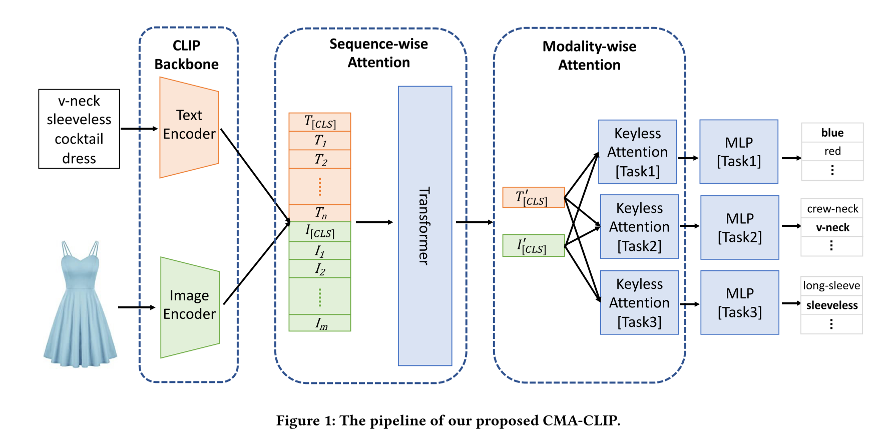| [[Paper](https://arxiv.org/pdf/2112.03562)] |
|    **CLIP-Art: Contrastive Pre-training for Fine-Grained Art Classification**  | 文章主要解决两个挑战：实例检索和细粒度艺术品属性识别. 主要是训练数据生成+CLIP微调， 没太多可说的东西.|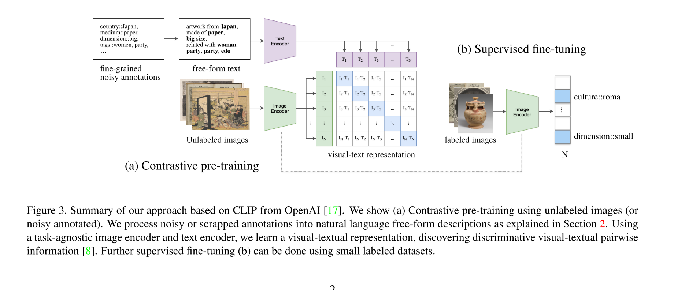| [[Github](https://github.com/KeremTurgutlu/clip_art)]   [[Paper](https://openaccess.thecvf.com/content/CVPR2021W/CVFAD/papers/Conde_CLIP-Art_Contrastive_Pre-Training_for_Fine-Grained_Art_Classification_CVPRW_2021_paper.pdf)] |
|2022|
|    **Tip-Adapter: Training-free Adaption of CLIP**  |为了提高Clip的few-shot能力，文章提出一种免训练的方法，名为Tip-Adapter. 通过从少样本监督中构建query-key缓存模型来获取适配器的权重. 通过缓存模型，与传统的finetune方法相比，Tip-Adapter表现出极高的效率. || [[Github](https://github.com/gaopengcuhk/Tip-Adapter)]   [[Paper]( https://arxiv.org/pdf/2207.09519)]  |
|    **CALIP: Zero-Shot Enhancement of CLIP with Parameter-free Attention**  | 文章出发点是如何在不finetune的情况下，提升clip在下游任务上的zero-shot能力.文章提出了一种parameter-free的注意力模块(CALIP)，引导视觉和文本表示相互交互，并通过注意力探索跨模式信息特征.通过这种方式，图像与文本两个模态特征相互感知，以实现更好的自适应零样本对齐.|| [[Github](https://github.com/ZiyuGuo99/CALIP)]   [[Paper](https://arxiv.org/pdf/2209.14169)]  |
|      **CoOp: Learning to Prompt for Vision-Language Models**  | 受NLP领域prompt learning的启发，文章提出了Context Optimization(CoOp)，用于将类CLIP式的视觉语言模型迁移到下游图像识别任务.具体而言，CoOp将预训练模型参数freeze，使用可学习向量对提示的上下文单词进行建模.作者在11个下游任务上验证CoOp的有效性，结果显示CoOp的性能明显好于原始预训练模型如CLIP.|| [[Github](https://github.com/KaiyangZhou/CoOp)]   [[Paper](https://arxiv.org/pdf/2109.01134)] |
|      **CoCoOp: Conditional Prompt Learning for Vision-Language Models**  |针对CoOp泛化性差的问题，即:学习到的上下文对数据集中unseen classes的泛化性不好.文章提出Conditional Context Optimization (CoCoOp)，在CoOp基础上，引入一个轻量级的网络，名为Meta-Net:为每张图像生成input-conditional tokens. input-conditional tokens与 CoOp中的learnable vectors叠加，共同参与训练.大量实验表明，对于unseen classes，CoCoOp 比 CoOp 的泛化能力要好得多，甚至显示出超越单个数据集的可迁移性， 并产生更强的领域泛化性能 || [[Github](https://github.com/KaiyangZhou/CoOp)]   [[Paper](https://arxiv.org/pdf/2203.05557)] |
|      **CLIP Itself is a Strong Fine-tuner:Achieving 85.7% and 88.0% Top-1 Accuracy with ViT-B and ViT-L on ImageNet**  | 文章通过一系列试验，验证使用不同超参数finetune clip后在下游分类任务的表现.  || [[Github](https://github.com/LightDXY/FT-CLIP)]   [[Paper](https://arxiv.org/pdf/2212.06138)] |
|     **CLIPN for Zero-Shot OOD Detection: Teaching CLIP to Say No**  | 文章的motivation是通过向CLIP提供positive的语义提示和negative的语义提示，以此让CLIP拥有区分OOD（Out-of-distribution）和ID（in-distribution）样本的能力。具体来说,文章设计了一个可学习的"否定"提示及一个针对"否定"的文本编码器,以捕捉图像中的否定语义.|| [[Github](https://github.com/xmed-lab/CLIPN)]   [[Paper](https://arxiv.org/pdf/2308.12213v2)] |
|     **MaPLe: Multi-modal Prompt Learning**  |诸如CLIP的VLM模型，对文本提示很敏感，需要仔细选择prompt才能发挥良好作用.  针对下游任务，近期比较常用学习提示作为文本输入的方案（learn prompts）微调CLIP.  作者认为只在单个branch中使用提示来调整 CLIP的表示并不是最优的，因为它不允许灵活地动态调整下游任务的两个表示空间.  为解决这个问题，作者提出了MaPLe，在image和text两个分支都进行prompt learning，提高两个模态的表征一致性. 与CoCoOp 相比，MaPLe 表现出了良好的性能，在 11 个不同的图像识别数据集性能平均明显提升. || [[Github](https://github.com/muzairkhattak/multimodal-prompt-learning)]   [[Paper](https://arxiv.org/pdf/2210.03117)] |
|2023|
|    **TagCLIP: A Local-to-Global Framework to Enhance Open-Vocabulary Multi-Label Classification of CLIP Without Training**  |CLIP在开放词汇分类任务上表现出众，但在多标签分类任务表现不足，因为CLIP的图像编码器中的token经过训练以捕获全局特征，以此区分由对比损失监督的不同文本描述，这对于单标签分类非常有效. 多标签分类恰恰相反，全局特征往往由最突出的类别主导，而 softmax 操作的对比性质加剧了这种情况.  针对以上问题，作者提出TagCLIP ，无需额外训练提升CLIP 的多标签分类能力.  具体而言，1. 作者假设并实验证明，CLIP的图像编码器最后一层的attention操作破坏了空间信息，即前面的CLIP特征保有spatial information ，因此TagCLIP忽略最后一个self-attention操作来维持spatial information.  2.提出一种local-to-global 的方法，即首先经过patch级的分类得到粗标签(很巧妙，输入的text prompt为标签，CLIP的text encoder当作分类器，基于contrastive loss得到的相似度矩阵即为score)，然后使用dual-masking attention refinement（DMAR）优化分类score（直接借助Vit，因为self-attention学习了图像patch之间的关系，可直接用来refine patch之间的相似度），最后经过class-wise reidentification (CWR) 模块得到最终结果（patch对应原图区域送到CLIP，变成一个单标签分类问题，做double check）.|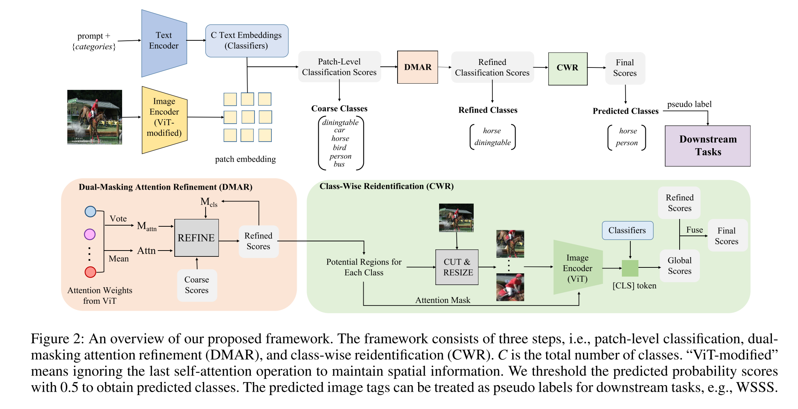| [[Github](https://github.com/linyq2117/TagCLIP)]   [[Paper](https://arxiv.org/pdf/2312.12828)] |
|    **Multimodality Helps Unimodality: Cross-Modal Few-Shot Learning with Multimodal Models**  | 文章阐述了一个观点，人类可以通过学习一个物体的多个维度知识，来增强对该物体的视觉理解. 如人们可以通过阅读有关狗的内容并听它们的叫声来在视觉维度区分狗.  基于此，作者提出了一种跨模式使用的简单策略：将来自不同模态的样本做为额外的小样本数据.  本质上就是将n-shot的问题转为（n+1）shot. 这种简单的策略可以通过简单的线性分类器产生全面的 SOTA 结果.    🧟‍♂️:  看完这篇文章有点迷糊，不知道在干嘛...个人理解虽然数据是来自不同模态，但其描述的本质都是一个东西，而例如CLIP这样的VLM模型，其本质就是将不同模态特征映射到一个空间上，所以虽然是不同模态的数据，但其本质是一个. 因此文章将不同模态的样本做为额外的小样本数据 ，本质就是增加了小样本数据，因此可以提升表现. 个人粗浅的理解. |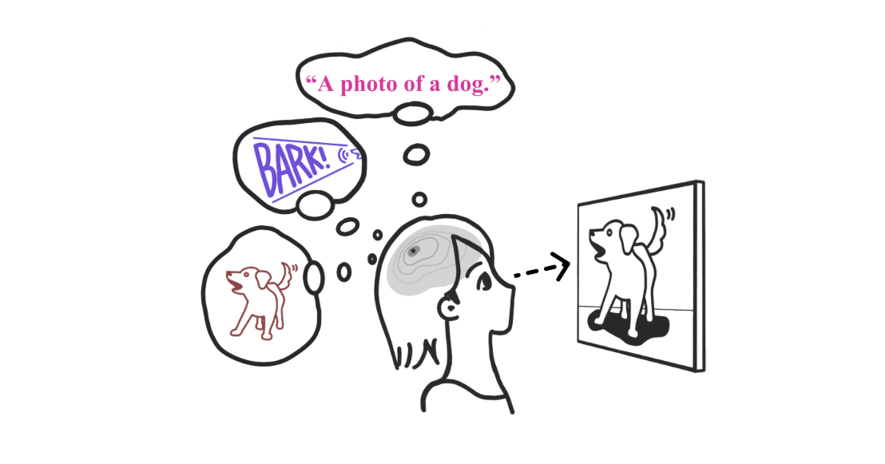| [[Github](https://github.com/linzhiqiu/cross_modal_adaptation)]   [[Paper](https://arxiv.org/pdf/2301.06267)] |
|2024|
|    **AMU-Tuning: Effective Logit Bias for CLIP-based Few-shot Learning**  | 提出了一种名为AMU-Tuning的方法，用于改进基于CLIP模型的小样本学习性能. 该方法通过分析关键组件——logit特征、logit预测器和logit融合——来学习有效的logit偏差，并通过利用辅助特征、多分支训练的特征初始化线性分类器以及基于不确定性的融合策略，将logit偏差有效地整合到CLIP中，以提高小样本分类的准确性. || [[Github](https://github.com/TJU-sjyj/AMU-Tuning)]   [[Paper](https://arxiv.org/pdf/2404.089588)] |
|    **Transductive Zero-Shot and Few-Shot CLIP**  | 将转导推理（Transductive Inference）引入到VLM中，改进小样本分类问题.  具体做法是利用支持集（support set）中可用的监督（label）来预测查询样本（query）的类别.    🧟‍♂️: 转导推理（Transductive Inference）是一种通过观察特定的训练样本，进而预测特定的测试样本的方法.  文章中的公式很多，个人没有完全读懂... |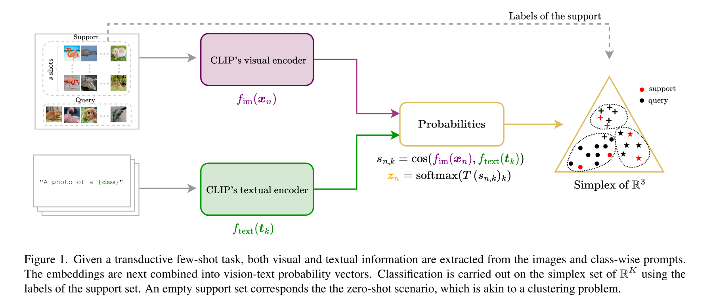| [[Github](https://github.com/SegoleneMartin/transductive-CLIP)]   [[Paper](https://hal.science/hal-04534868v1/document)] |
|    **DeIL : Direct-and-Inverse CLIP for Open-World Few-Shot Learning**  | 针对开放世界少样本学习-Open-World Few-Shot Learning (OFSL)问题，作者引入Direct-and-Inverse的概念 ，提出了一种创新的方法DeIL，借助CLIP解决OFSL问题.  DeIL由以下几个模块构成，1. DeIL-Pretrainer：使用CLIPN计算目标图片不属于label类别的概率（Inverse-phase），找到噪声图片，然后利用CLIP修正噪声图片的label（Direct-phase） ; 2. 数据增强模块：借助DALL-E ，对改正后的训练数据集做增强; 3. DeIL-Adapter ：CLIP+Adaptor分类器，loss包括两部分，分类器直接预测的分类损失以及使用 CLIPN 的逆向推理后选择的负样本正样本的对比损失.  注意的是，在推理阶段，仅需要 DeIL-Adapter 内的分类器....   🧟‍♂️:  真的绕|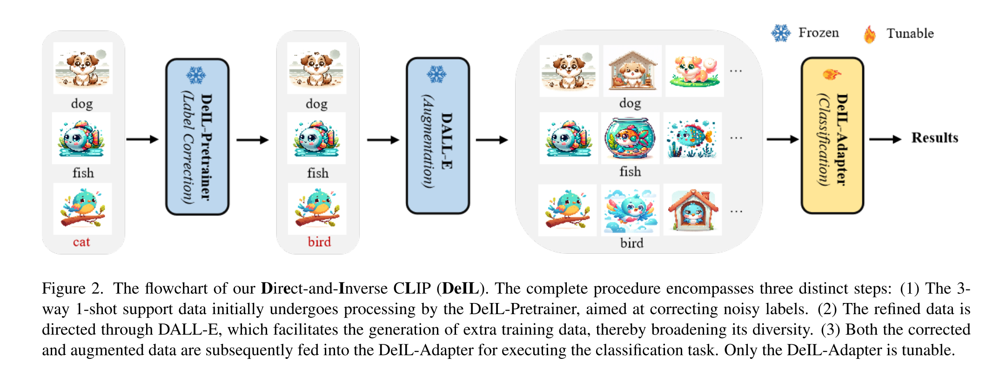| [[Github](https://github.com/SegoleneMartin/The-Shuai/DeIL)]   [[Paper](https://openaccess.thecvf.com/content/CVPR2024/papers/Shao_DeIL_Direct-and-Inverse_CLIP_for_Open-World_Few-Shot_Learning_CVPR_2024_paper.pdf)] |

## Retrieval

| Title | Abstract | Intro | Useful Links |
|:----| :---:| :----: | :---:|
|2021|
|    **CLIP4Clip: An Empirical Study of CLIP for End to End Video Clip Retrieval**  | 文章提出了 CLIP4Clip 模型，以端到端的方式将 CLIP 模型的知识迁移到视频语言检索任务上，研究了三种相似度计算方法：无参数型、顺序型和紧密型.  文章从大量的实验中得出以下结论：1. 对于视频文本检索任务，只用一张图像来进行视频编码是不够；2.  在大规模的视频-文本训练集上进行预训练，可以提高性能，特别是对于零样本预测的能力；3.使用预训练的CLIP，对于小数据集，最好不要引入新参数，视频帧采用平均池化的方式；对于大数据集，最好引入更多参数，以学习大型数据集的时间依赖性； 4.作者给出了最佳超参数设置. |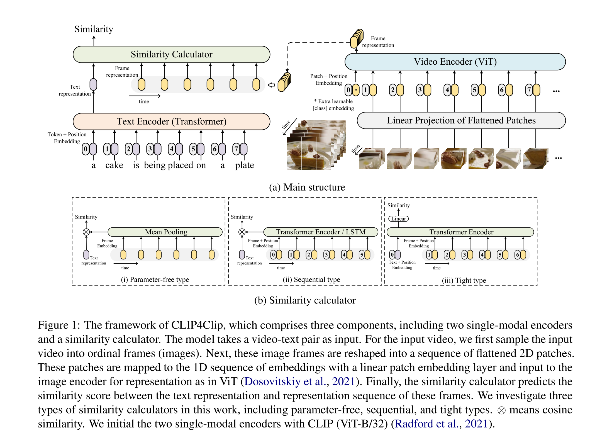  | [[Github](https://github.com/ArrowLuo/CLIP4Clip)]   [[Paper](https://arxiv.org/pdf/2104.08860)] |
|2022|
|    **CenterCLIP: Token Clustering for Efficient Text-Video Retrieval**  | 利用CLIP进行文本-视频检索任务，由于视频时域的连续性，会产生很多同质化的token，增加了计算成本. 为了减少冗余视频token的数量，作者提出a multi-segment token clustering算法，找到最具代表性的token并丢弃非必要的. 具体而言，将视频分片，每片单独聚类，且只保留簇的center tokens. 将所有center tokens拼接组成新的visual sequence送如入transformer进行训练. |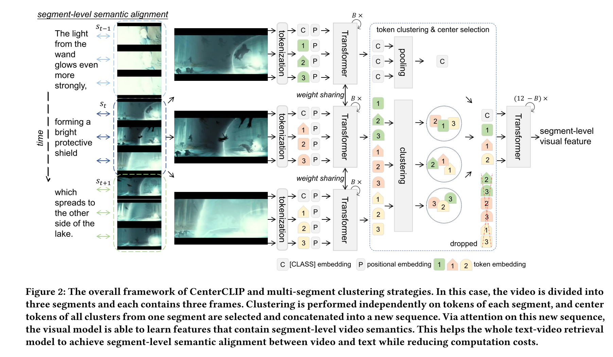  | [[Github](https://github.com/mzhaoshuai/CenterCLIP)]   [[Paper](https://arxiv.org/pdf/2205.00823)] |
|2023|
|    **Composed Image Retrieval using Contrastive Learning and Task-oriented CLIP-based Features**  | 使用clip进行检索. 分为两步：1.微调clip的text encoder 和image encoder；2.设计一个combiner，将两个模态特征fusion，用这个特征做retrieval. |   | [[Github](https://github.com/ABaldrati/CLIP4Cir)]   [[Paper](https://arxiv.org/pdf/2308.11485)] | 
|    **CLIP for All Things Zero-Shot Sketch-Based Image Retrieval, Fine-Grained or Not**  | 将CLIP应用于零样本草图检索任务（ZS-SBIR）,针对细粒度的检索做出改进. 主要包括1. prompt learning; 2. 引入一个正则项，使跨类别（数据集）的相对距离一致（最小化每个类别对之间的相对距离分布之间的KL散度）；3. patch shuffling，草图-图片数据对分成NxN的patch，随机做相同的shuffle. 作者认为打乱的草图应该更接近具有相同排列顺序打乱的图片，远离不同排列的图片. 这种permutation-invariance 有助于模型细粒度的理解.  通过这些设计，我与之前最先进的技术相比，性能显着提高了 26.9%.| 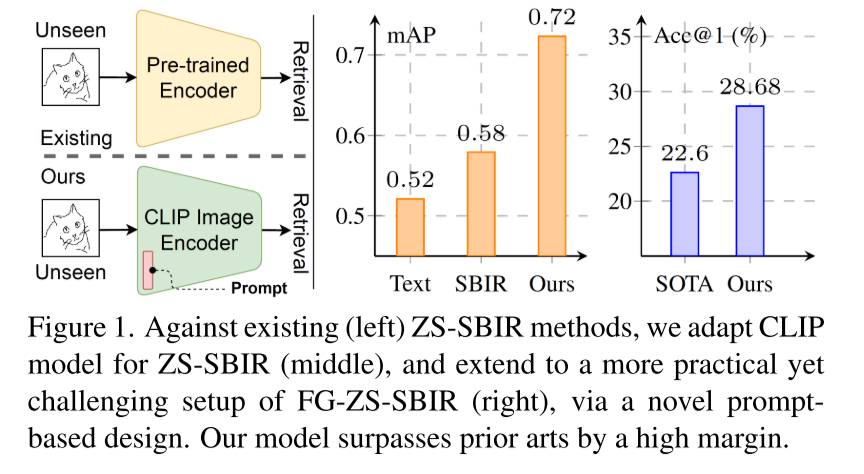| [[Github](https://github.com/aneeshan95/Sketch_LVM)]   [[Paper](https://arxiv.org/pdf/2303.13440)] |
|2024|
| **JINA CLIP: Your CLIP Model Is Also Your Text Retriever**  | 传统的text embedding模型，在文本到文本检索中出色，但无法执行cross-modal任务. 诸如Clip之类的模型，有效地对齐图像和文本嵌入，但由于其训练方法和上下文限制，因此未针对文本到文本检索进行优化. 文章提出了一种新颖的多任务对比训练方法，在单个模型中实现了state-of-the-art的文本到文本和文本到图像检索能力. |   | [[huggingface](https://huggingface.co/jinaai/jina-clip-v1)]   [[Paper](https://arxiv.org/pdf/2405.20204))] |

## Detection

| Title | Abstract | Intro | Useful Links |
|:----| :---:| :----: | :---:|
|2022|
|    **RegionCLIP: Region-based Language-Image Pretraining**  |虽然CLIP在zero-shot和transfer learning settings这样的图片分类任务上表现不俗，但如果直接将CLIP应用到目标检测这种识别图像区域的任务上，表现很差. 原因是存在domain shift，CLIP基于image-text pair的数据集训练，建立的是图片整体和文本描述的联系，与文本没有做局部、细粒度的对齐 . 为了解决这个问题，本文提出regionCLIP ，将图片局部与对应描述对齐，在特征空间实现region-text 对齐. 实验证明，在下游检测任务上，与CLIP相比性能明显提升.    🧟‍♂️: pretrain期间显式对齐图像区域和文本标记，有个点，无需人工标注region区域caption，使用的是伪标签，具体做法，建立一个object类别候选池，通过预训练的CLIP，可以将region（RPN提取）与object match起来，然后利用固定的prompt模版生成caption，比如region是一只狗，描述就是 a photo of dog.  这里如果借助LLaVa等模型生成caption，效果会不会更好？当然pretrain成本也会更高，需要balance. |  | [[Github](https://github.com/microsoft/RegionCLIP)]   [[Paper](https://arxiv.org/pdf/2112.09106)] |
|    **ReCLIP: A Strong Zero-shot Baseline for Referring Expression Comprehension**  | 借助CLIP的zero-shot能力解决REC问题，提出ReCLIP.  主要包括两个关键部分: 1. Isolated Proposal Scoring (IPS) , 通过crop proposals 和 模糊除当前proposal两种方式，提取局部区域，送入CLIP算一个score，两种方式分数相加; 2.  Spatial Relation Resolver: 因为CLIP处理空间关系能力比较弱，作者利用NLP的一些基本方法，借助spaCy，通过Semantic Trees等规则，计算proposals的最终得分.  注意的是，上述两个模块的输入描述非原始描述，经过了拆分，如noun chunk .|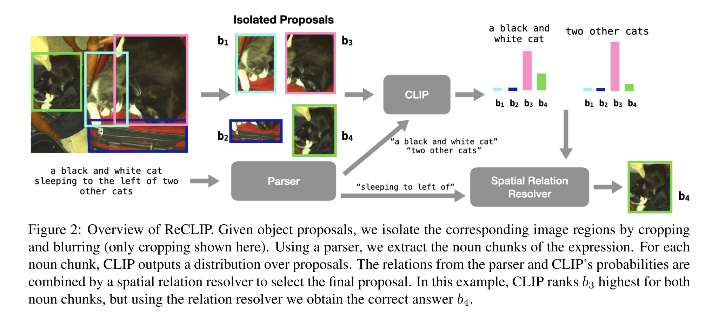| [[Github](https://github.com/allenai/reclip)]   [[Paper](https://arxiv.org/pdf/2204.05991)] |
|2023|
|    **CLIP-Count: Towards Text-Guided Zero-Shot Object Counting**  |文章提出一个端到端的框架--CLIP-Count，借助CLIP的多模态和zero-shot的能力来预测密度图，使用文本引导零样本数量计算.  为了将CLIP的image-level能力迁移到下游关注局部的密集任务上，提出patch-text contrastive loss，对齐text和patch的特征空间; 同时， 为了将textual information引入到密dense image features以进行文本引导计数，作者设计了a hierarchical patch-text interaction模块，实现两个模态的deep fusion.  实验表明，该方法人在群计数数据集表现出了sota的准确性和普遍性.  |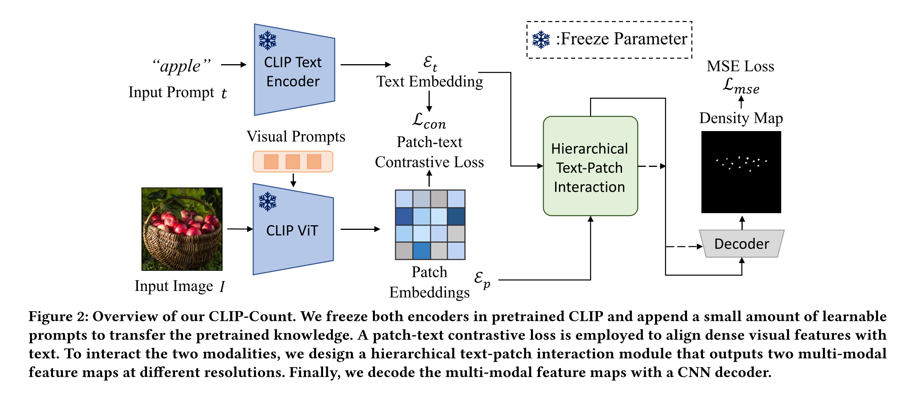| [[Github](https://github.com/songrise/CLIP-Count)]   [[Paper](https://arxiv.org/pdf/2305.07304)] |
|    **Turning a CLIP Model into a Scene Text Detector**  |将CLIP应用到文本检测任务上 , 作者提出名为TCM的文本检测框架，可以轻松插入现有的检测器. 该方法类似DBNet，模型输出一个HeatMap来回归出box.  主要改进点,1. prompt部分，Predefined  Prompt（“Text”） +  Learnable Prompt（CoOp方法 ） + conditional cue （两层feed-forward网络组成的language prompt generator，输入为clip 编码的图像embedding）. 关于为什么需要增加conditional cue ，作者认为虽然Predefined  Prompt和Learnable Prompt有效果，但如果使用场景的数据分布不一致，模型可能会受到有限的小样本或开放式场景的泛化能力的影响.  2. visual prompt : 文本-图像两个模态信息交互，从CLIP的图像编码器中恢复局部性特征，捕获细粒度信息以响应粗文本区域; 3.. 设计instance-language matching方法来对齐图像嵌入和文本嵌入，鼓励图像编码器从跨模式视觉语言先验中显式细化文本区域. |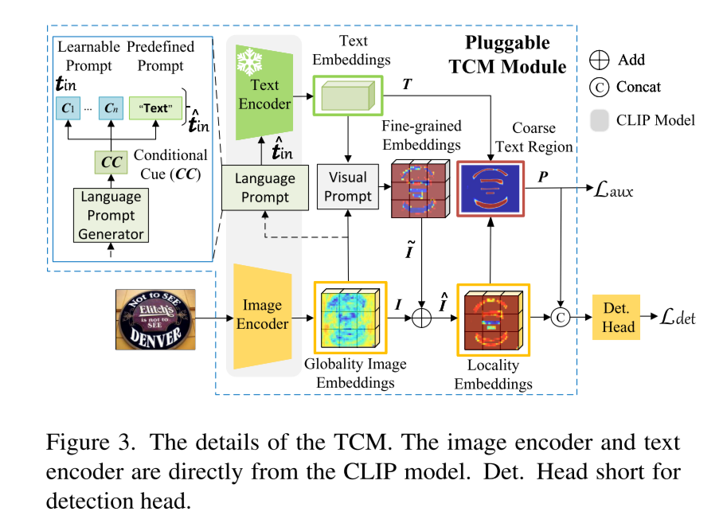| [[Github](https://github.com/wenwenyu/TCM)]   [[Paper](https://arxiv.org/pdf/2302.14338)] |
|    **CORA: Adapting CLIP for Open-Vocabulary Detection with Region Prompting and Anchor Pre-Matching**  | 借助VLM解决OVD问题，作者认为存在两个难点需要解决，1.VL使用整图训练，用到OVD任务存在分布不匹配问题；2. 如何对没见过类别的定位. 文章针对以上问题，提出一个 DETR 风格的框架，名为CORA.  使用Region prompting来减轻整体到局部的分布差距；Anchor Pre-matching 通过类感知匹配机制学习可泛化的对象定位.  具体而言，Region prompting嵌在Region Classifier模块，该模块主要过程如下：图片经过CLIP 的image encoder （ResNet结构）的1-3层提取特征，经过RoIAlign转为区域特征，再经过CLIP 的image encoder最后一层，之后与可学习的Region Prompts逐元素加法得到Region Embedding. Anchor Pre-Matching使用CLIP分类模型作为指标，为每一个groundtruth分配相同标签的anchor box集合, 目的是为了实现一个能定位潜在物体的网络. |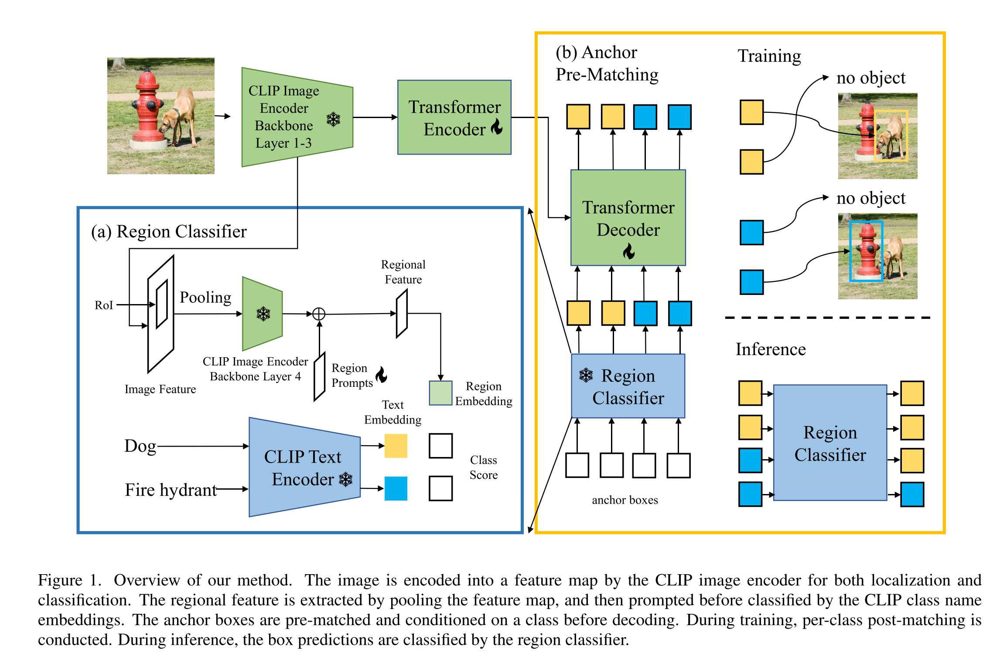| [[Github](https://github.com/tgxs002/CORA)]   [[Paper](https://arxiv.org/pdf/2303.13076)] |
|    **ANOMALYCLIP: OBJECT-AGNOSTIC PROMPT LEARNING FOR ZERO-SHOT ANOMALY DETECTION**  |借助VLM解决零样本异常检测任务(ZSAD)，但VLM 更多地关注于前景目标，不关心图像中的异常/正常. 本文提出AnomalyCLIP,  提升CLIP在ZSAD任务上的表现.  作者认为，学习与对象无关的文本提示，无论其前景对象如何，都可以捕获图像中的正常和异常特征.  AnomalyCLIP设计了object-agnostic的可学习的prompt模版（2个通用的与对象无关的文本提示模板，[object] & [damaged][object]）, 来学习正常和异常的情况. 使用glocal context optimization，将global和fine-grained的异常语义纳入与对象无关的文本提示学习中.  最后利用textual prompt tuning和DPAM在CLIP的text和local visuals 空间进行prompt学习.  || [[Github](https://github.com/zqhang/AnomalyCLIP)]   [[Paper](https://arxiv.org/pdf/2310.18961)] |

## Segmentation

| Title | Abstract | Intro | Useful Links |
|:----| :---:| :----: | :---:|
|2022|
|    **DenseCLIP: Language-Guided Dense Prediction with Context-Aware Prompting**  | 文章提出一种新的框架，将clip的预训练知识迁移到下游分割、目标检测等密集任务. 作者将CLIP 中的图像-文本匹配问题转换为像素文本匹配问题，并使用像素-文本匹配问题，使用像素-文本匹配得分(pixel-text score maps)来指导密集预测模型的学习.  通过进一步使用图像中的上下文信息来提示语言模型，促进模型更好地利用预训练的知识. || [[Github](https://github.com/raoyongming/DenseCLIP)]   [[Paper](https://arxiv.org/pdf/2112.01518)] |

## Captioning

| Title | Abstract | Intro | Useful Links |
|:----| :---:| :----: | :---:|
|2021|
|    **ClipCap: CLIP Prefix for Image Captioning**  | 作者提出了CLIPCap模型来生成image captions.具体而言，借助CLIP提取图像embeadding，训练一个mapping network，为每一个caption生成前缀.直接和caption embedding 做结合（concatenation），形成新的embedding，送入GPT-2生成captions. || [[Github](https://github.com/rmokady/CLIP_prefix_caption)]   [[Paper](https://arxiv.org/pdf/2111.09734)] |
|2022|
|    **CapDec: Text-Only Training for Image Captioning using Noise-Injected CLIP**  | 文章认为，Clip模型的训练，就是将抽取的文本和图片特征尽可能相似. 基于这个观察，只需要设计一个decoder，仅利用文本数据学习如何将文本特征“翻译”到文本，即可实现图片captioning.    🧟‍♂️:脑洞很大，又很合理，喜欢这篇文章~👍|| [[Github](https://github.com/DavidHuji/CapDec)]   [[Paper](https://arxiv.org/pdf/2211.00575)] |
|2023|
|    **DECAP: DECODING CLIP LATENTS FOR ZERO-SHOT CAPTIONING VIA TEXT-ONLY TRAINING**  |文章提出一个简单的框架来实现Zero-shot Captioning. clip的 text encoder作为输入，使用text-only数据训练一个text decoder。同时，为了解决多模态对比学习中的modality gap问题，作者将 image embedding 送入 text decoder 中解码，实现 Zero-shot Captioning.  || [[Github](https://github.com/dhg-wei/DeCap)]   [[Paper](https://openreview.net/pdf?id=Lt8bMlhiwx2)] |
|    **Fine-grained Image Captioning with CLIP Reward**  | 开源图像描述生成的数据集中，文本描述通常描述最显着的常见对象.  因此使用这些数据训练的图像描述生成模型，往往会忽略图像之间的的特定和详细细节.  本文为了生成更具描述性和独特的描述，使用CLIP的图像文本相似度作为描述生成模型的reward，同时，文章还提出一种 CLIP 文本编码器finetune的策略，以改进文本编码器的语法能力. |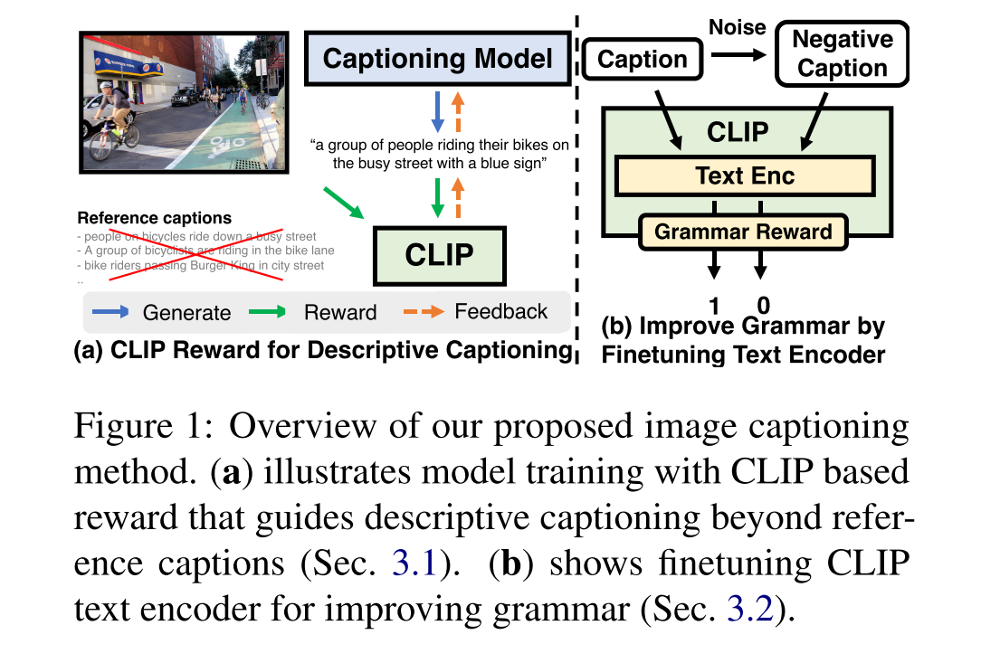| [[Github](https://github.com/j-min/CLIP-Caption-Reward)]   [[Paper](https://arxiv.org/pdf/2205.13115)] |

## Generation

| Title | Abstract | Intro | Useful Links |
|:----| :---:| :----: | :---:|
|2022|
|    **Image-based CLIP-Guided Essence Transfer**  | StyleGAN与CLIP结合实现人脸的风格迁移.   🧟‍♂️: 略读了一下，之前做过一段时间的Gan，对StyleGan还是比较了解的.  CLIP之前，基于StyleGan做一些人脸属性编辑，方法基本大同小异，效用encoder把图片映射到latent空间，然后在这个latent空间对这个向量做一些手脚，比如可以某个方向偏移、额外利用一些分类、或者做fusion等.  本文依旧是latent空间去加一个shift vector，文章称作essence vector，然后利用CLIP 的image encoder去施加监督. 文章给的生成case看着效果还可以，具体还需要测试. | 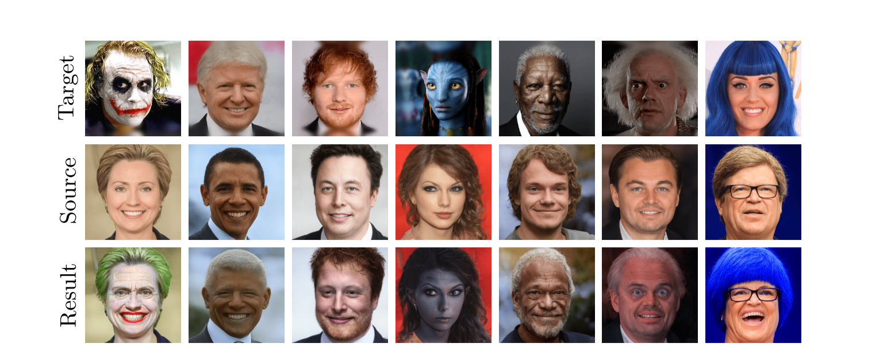  | [[Github](https://github.com/hila-chefer/TargetCLIP)]   [[Paper](https://arxiv.org/pdf/2110.12427)] |
|    **CLIPasso: Semantically-Aware Object Sketching**  | SIGGRAPH 2022 (Best Paper Award) 一种将图像中的物体转换为草图的方法，允许不同层次的抽象.    🧟‍♂️关键词: 显着性引导的初始化(a saliency-guided initialization)、基于局部注意力图（based on the local attention maps）、B´ezier curves（贝塞尔曲线是通过一组控制点（P0...Pn）来定义的，P0和Pn是曲线的起点和终点,中间控制点通常不在曲线上）. 首先通过显著图初始化草图的初始点(通过热力图)，然后去迭代更新B´ezier curves 参数（那一组点），通过一个[rasterizer](https://dl.acm.org/doi/pdf/10.1145/3414685.3417871)绘制出草图，借助CLIP计算loss，更新那一组点 ，直到收敛|   | [[Github](https://github.com/yael-vinker/CLIPasso)]   [[Paper](https://arxiv.org/pdf/2202.05822)] |
|2024|
| **CLIP4Sketch: Enhancing Sketch to Mugshot Matching through Dataset Augmentation using Diffusion Models**  | 文章提出一种生成不同类型草图的方法，名为CLIP4Sketch.  该方法利用DDPM来生成草图，使用CLIP 和 Adaface 分别提取输入参考图片的embedding，二者fusion后与草图风格的文本描述embedding再次fusion，作为扩散模型的条件，精确控制人物身份和草图的风格. 作者利用CLIP4Sketch生成数据，并训练人脸识别模型，验证了该方案的有效性.  | 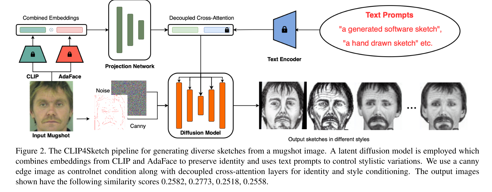  | [[Paper](https://arxiv.org/pdf/2408.01233)] |

## Video

| Title | Abstract | Intro | Useful Links |
|:----| :---:| :----: | :---:|
|2022|
|    **Frozen CLIP Models are Efficient Video Learners**  | 作者认为针对视频识别任务，端到端的训练、微调模型的效率不高，此外，如果想要借助CLIP的强大zero-shot能力，但却要微调模型，会导致灾难性遗忘.  预训练图像模型的端到端微调并不总是理想的选择，这需要更有效的学习策略来将知识从图像转移到视频，本文提出Efficient Video Learning (EVL) ，直接将CLIP模型参数freeze，训练一个高质量视频识别模型.  使用轻量级的 Transformer 解码器作为基础网络，使用freezed CLIP提取视频帧的空间特征作为KV送入decoder，同时作者设计了local temporal 模块来学习帧间的时域关系.|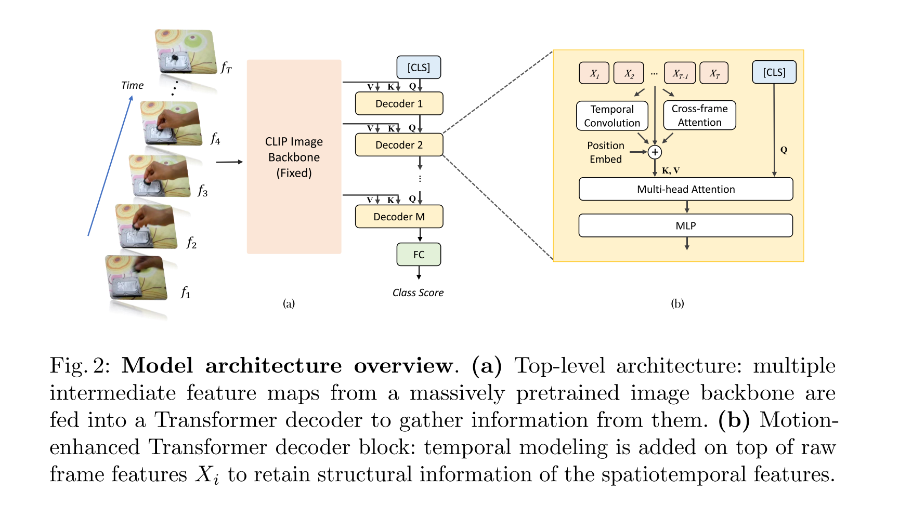| [[Github](https://github.com/OpenGVLab/efficient-video-recognition)]   [[Paper](https://arxiv.org/pdf/2208.03550)] |
|2023|
|    **CLIP-guided Prototype Modulating for Few-shot Action Recognition**  | 文章提出名为CLIP-FSAR的框架，将CLIP引入小样本动作识别任务（few-shot action recognition）. CLIP-FSAR充分利用了 CLIP 模型的多模态知识，并设计了视频-文本对比loss来模拟原始CLIP的训练模式，以及prototype modulation来生成可靠的原型.|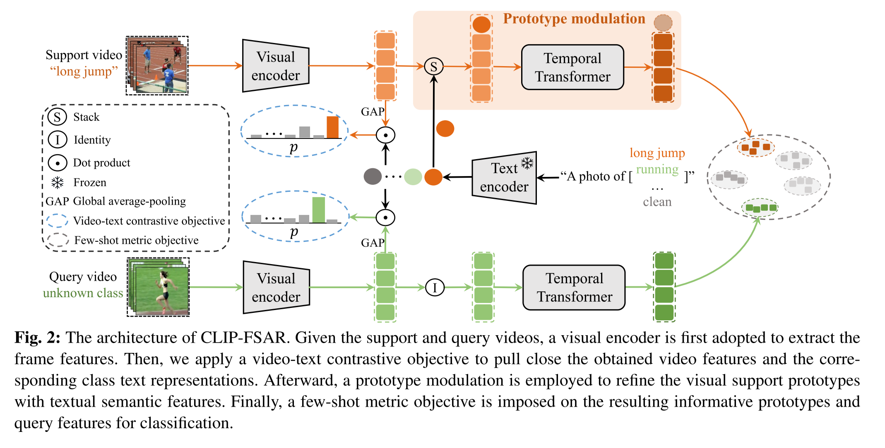| [[Github](https://github.com/alibaba-mmai-research/CLIP-FSAR)]   [[Paper](https://arxiv.org/pdf/2303.02982)] |
|    **Fine-tuned CLIP Models are Efficient Video Learners**  | 文章探索如何将CLIP的强大能力从图片域迁移到视频域.  提出Video Fine-tuned CLIP (ViFi-CLIP)，证明其可以弥合从图像到视频的domain gap . 针对数据量不足以全量微调的情况，提出了bridge and prompt 的方法来减小上述gap.    🧟‍♂️: 《Frozen CLIP Models are Efficient Video Learners》 vs  《Fine-tuned CLIP Models are Efficient Video Learners》，打一架吧～|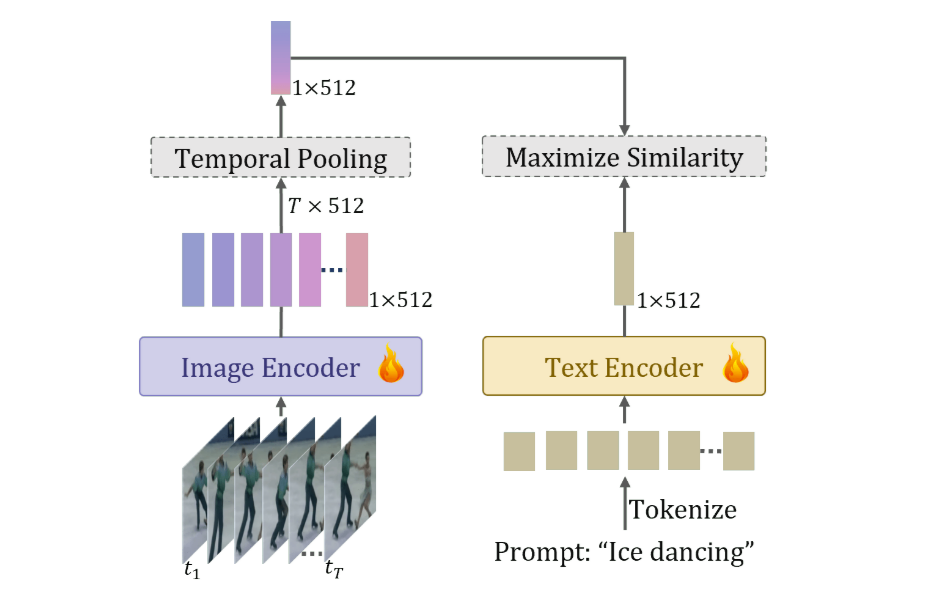| [[Github](https://github.com/muzairkhattak/ViFi-CLIP)]   [[Paper](https://arxiv.org/pdf/2212.03640)] |

|2024|
|    **FROSTER: FROZEN CLIP IS A STRONG TEACHER FOR OPEN-VOCABULARY ACTION RECOGNITION**  |本文的研究课题是开集动作识别（open-vocabulary action recognition），具体来说就是测试集中的视频动作类别与训练集动作类别基本没有重叠或重叠程度很小，因此这需要模型具备较高的泛化性能. 目前视频领域主流的做法是基于图像-文本对预训练的模型（主要是CLIP）先在视频数据集上进行fine-tuning，然后再进行测试集的验证. 通过实验探索，我们发现：尽管fine-tuning可以让CLIP具备不错的视频特征提取的能力，但这也会让它失去大规模预训练所得到的泛化性能.  具体的表现就是，那些在闭集（closed-set）场景下优秀的视频分类器们，一到了开集场景下实验性能便大大缩水，甚至不如原先的预训练CLIP模型了. 因此如何让视频模型在fine-tuning的同时还能保持住预训练的知识，成为了本文的研究重点.  作者认为一个基于CLIP的开集动作识别模型应该具备以下特点：1.由于CLIP预训练是没有使用视频数据集的，因此模型需要学习视频域的相关知识（video-specific），用于弥补CLIP在时域建模方面的不足; 2模型需要能保持住预训练CLIP的能力，这对于泛化性能力的保持很重要.   作者提出了一种新的结构FROSTER用来同时实现以上两个目标：针对第一点（时域建模），直接采用cross-entropy loss对finetune模型进行监督. 针对第二点（泛化性特征保持），将frozen clip作为teacher模型对fine-tune模型的特征进行蒸馏，借此希望预训练的能力能够得到很好地保持. 蒸馏过程类似于一个正则化项，确保fine-tune特征不会偏离frozen clip的特征太远. 因为有两个不同的目标，我们需要在它们之间平衡特征学习. |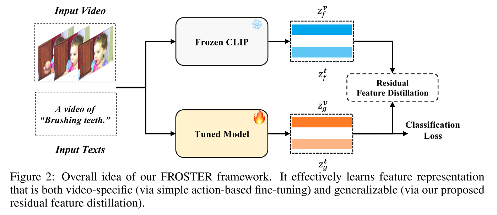| [[Github](https://github.com/Visual-AI/FROSTER)]   [[Paper](https://hal.science/hal-04534868v1/document)]   [知乎](https://zhuanlan.zhihu.com/p/681708426) |
|    **OmniCLIP: Adapting CLIP for Video Recognition with Spatial-Temporal Omni-Scale Feature Learning**  | 文章提出OmniCLIP，将CLIP用于视频识别. 在视频识别任务上，作者认为时间信息的融合应该是全方位的，包括空间、时间和时空. 基于这个观点，OmniCLIP 重点学习涵盖空间、时间和动态时空尺度的综合特征，作者将其称为omni-scale features.  OmniCLIP使用Parallel Temporal Adapter (PTA) 模块增强 CLIP 在时间建模方面的能力，以及Self-Prompt Generator (SPG) 模块来处理不同空间尺度上对象的动态交互和不规则运动. 实验证明，OmniCLIP 在HMDB51等数据集上表现优异. |  | [[Github](https://github.com/chuangchuangtan/XiaoBuL/OmniCLIP)]   [[Paper](https://arxiv.org/pdf/2408.06158)] |

## Other

| Title | Abstract | Intro | Useful Links |
|:----| :---:| :----: | :---:|
|2022|
|    **Democratizing Contrastive Language-Image Pre-training: A CLIP Benchmark of Data, Model, and Supervision**  | 文章提出CLIP-benchmark，是第一个对CLIP及其变体进行评估、分析和测试的基准. 同时，作者提出三个观点，1.数据质量对性能有很大影响；2..某些supervision对卷积网络（ConvNets）和视觉变换器（ViT）有不同的影响. 适当的supervision可以有效地提高CLIP的性能; 3.减少文本编码器可以降低训练成本，但对最终性能影响不大.  此外，作者将DeCLIP与FLIP结合，得到一个性能较好的CLIP变体: DeFILIP.|| [[Github](https://github.com/Sense-GVT/DeCLIP)]   [[Paper](https://arxiv.org/pdf/2203.05796)] |
|    **Exploring CLIP for Assessing the Look and Feel of Images**  | 借助CLIP做IQA，文章实验证明，CLIP 捕获了有意义的priors，可以很好地推广到不同的感知评估 . |  | [[Github](https://github.com/IceClear/CLIP-IQA)]   [[Paper](https://arxiv.org/pdf/2207.12396)] |
|    **CLIP goes 3D: Leveraging Prompt Tuning for Language Grounded
3D Recognition**  | 本文提出MotionCLIP，一种 3D 人体运动auto-encoder，具有特征空间解缠结、与高度语义的文本描述特征对齐的特性. MotionCLIP将人体运动流形与 CLIP 空间对齐，隐式地将 CLIP 极其丰富的语义知识注入到流形中. 文章同时证明，尽管 CLIP 从未见过运动域，但MotionCLIP 提供了前所未有的文本到运动的能力，允许域外操作、解纠缠的编辑和抽象语言规范的能力. | 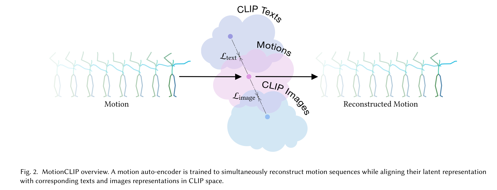 | [[Github](https://github.com/GuyTevet/MotionCLIP)]   [[Paper](https://arxiv.org/pdf/2203.08063)] |
|    **CLIP goes 3D: Leveraging Prompt Tuning for Language Grounded
3D Recognition**  | 文章提出了一个名为 CG3D（CLIP Goes 3D）的新预训练框架，该框架使用自然语言监督来训练 3D 编码器，同时还注入了CLIP zero-shot能力. | 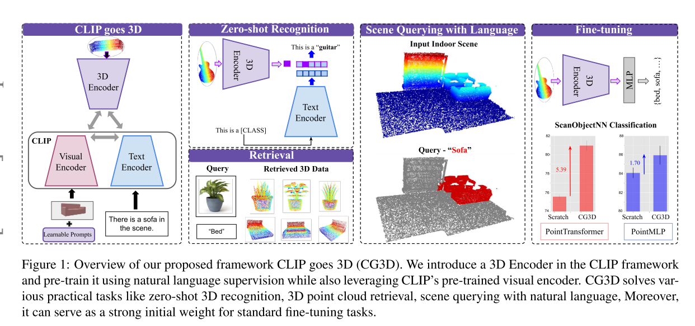 | [[Github](https://github.com/deeptibhegde/CLIP-goes-3D)]   [[Paper](https://arxiv.org/pdf/2303.11313)] |
|2024|
|    **CLIPCleaner: Cleaning Noisy Labels with CLIP**  | 文章首次提出利用 VL模型进行样本选择来解决噪声标签学习 (LNL) 问题.  作者使用CLIP，借助其天然的多模态和zero-shot能力，提出一种CLIPCleaner的方法来进行样本选择，并从理论和经验上证实了其有效性（大量公式警告） . |  | [[Github](https://github.com/MrChenFeng/CLIPCleaner_ACMMM2024)]   [[Paper](https://www.arxiv.org/pdf/2408.10012)] |
|    **C2P-CLIP: Injecting Category Common Prompt in CLIP to Enhance Generalization in Deepfake Detection**  | 文章涉及AIGC 检测方向，提出一种能够识别各种伪造图像的方法.  首先作者通过实验分析CLIP，认为CLIP 可以通过识别相似的概念来检测深度伪造品. 基于此，引入类别通用提示CLIP（Category Common Prompt CLIP）--C2P-CLIP，它将类别通用提示集成到文本编码器中，将类别相关概念注入到图像编码器中，从而增强检测性能.  实验证明，此方案在UniversalFakeDetect 和GenImage 上取得了SOTA的效果.| 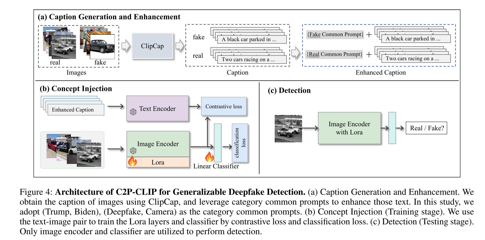 | [[Github](https://github.com/chuangchuangtan/C2P-CLIP-DeepfakeDetection)]   [[Paper](https://arxiv.org/pdf/2408.09647)] |

